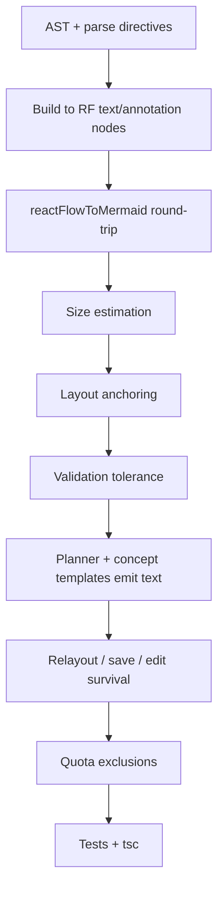

# AI-generated free text in diagrams (headings, notes, labels)

Implementation plan for letting the AI add **text elements** to diagrams — a title / section headings and free-form notes — in addition to shape nodes and edges. Today the AI pipeline only emits nodes + edges; the canvas already supports `textLabelNode` (editor shortcut `T`) and `annotationNode` (context menu), but nothing in the generation path produces them.

Goal: prompt → diagram output can include text nodes that survive layout, save/load, the LR/TB toggler, the Mermaid panel round-trip, edit mode, and SVG export.

## Defaults / decisions

- **Transport:** Mermaid is the canonical intermediate representation, so text must be representable in Mermaid and round-trippable. We use structured Mermaid comment directives:
  - `%% archdraw-text: {id, text, size, anchor}` → `textLabelNode`
  - `%% archdraw-note: {id, title, body, size, anchor}` → `annotationNode`
  - Mermaid ignores comments (invisible to stock Mermaid renderers), but our parser captures them **before** comment stripping.
- **`anchor` values (v1):** `top` (heading band above the graph), `subgraph:<id>` (above a group), `node:<id>` (beside a node), `none` (free-floating, preserve given position on round-trip). Layout fills positions for `top`/`subgraph`/`node`; `none` keeps the stored position.
- **Text nodes do not participate in Dagre ranking** and never connect to edges. They are placed after layout against the final graph/subgraph bounding boxes.
- **Text nodes do not count** toward node caps (quota, `maxNodes`, final node-count validation).

## Checklist

- [x] Step 1: AST + parser support for `%% archdraw-text` / `%% archdraw-note`
- [x] Step 2: Build stage → RF `textLabelNode` / `annotationNode`
- [x] Step 3: `reactFlowToMermaid` round-trip (emit directives, skip text nodes)
- [x] Step 4: Text size estimation helper + tests
- [x] Step 5: Layout placement (exclude from Dagre; post-layout anchoring)
- [x] Step 6: Validation + scoring tolerate text nodes (no node/edge counting)
- [x] Step 7: Planner prompt teaches title + notes; concept templates add canned titles
- [x] Step 8: Relayout / save-load / edit-mode survival + Mermaid panel round-trip
- [x] Step 9: Node-count quotas exclude text nodes
- [x] Step 10: Tests + tsc green



---

## Step 1 — AST + parser support (P0)

**Files:** [frontend/lib/mermaid/types.ts](../frontend/lib/mermaid/types.ts), [frontend/lib/mermaid/parse.ts](../frontend/lib/mermaid/parse.ts)

- Add a `ParsedText` interface and a `texts: ParsedText[]` field on `MermaidAST`:
  ```ts
  export type TextAnchor = 'top' | 'subgraph' | 'node' | 'none'
  export interface ParsedText {
    id: string
    text: string
    size?: 'small' | 'medium' | 'large' | 'heading'
    title?: string          // for notes
    body?: string           // for notes
    kind: 'text' | 'note'
    anchor?: TextAnchor
    anchorTarget?: string   // subgraph/node id
    position?: { x: number; y: number } | null  // preserved for anchor: none
  }
  ```
- In the parse loop, inspect `rawLine` (not the comment-stripped `cleanLine`) for the two markers before any other handling:
  - `%% archdraw-text: { ... }` and `%% archdraw-note: { ... }` — parse the JSON object, validate `id`/`text`, push to `texts`.
- Keep `stripComments` behavior for everything else unchanged.
- Treat unknown/malformed directives as plain comments (skip, add nothing) — never fail the parse over a text directive.
- The "no nodes or edges were parsed" total-failure guard (`parse.ts` ~line 878) stays node/edge-based; a diagram that is only text is still valid, so `texts.length > 0` should not count as failure.

---

## Step 2 — Build stage → RF nodes (P0)

**Files:** [frontend/lib/mermaid/buildReactFlow.ts](../frontend/lib/mermaid/buildReactFlow.ts), [frontend/lib/factory.ts](../frontend/lib/factory.ts)

- In `buildReactFlowObjects`, after subgraph nodes, iterate `ast.texts` and emit:
  - `kind: 'text'` → `type: 'textLabelNode'`, `data: { text, fontSize: size ?? 'medium', ... }`
  - `kind: 'note'` → `type: 'annotationNode'`, `data: { title, body, titleSize: size ?? 'medium', ... }`
- Set explicit `width`/`height` from the Step 4 size estimator so layout/export can use them (text labels are otherwise `fit-content`).
- Assign `parentNode` when `anchor: 'subgraph:<id>'` so the heading rides with the group through relayout.
- Do **not** add text nodes to `ast`-derived edge lists; text never has edges.
- These node types are already registered in [frontend/lib/constants/canvasTypes.ts](../frontend/lib/constants/canvasTypes.ts) and `store/diagram/constants.ts` — no registry change needed.

---

## Step 3 — Mermaid translator round-trip (P0)

**Files:** [frontend/lib/ai/pipeline/mermaid-pipeline/mermaidTranslator.ts](../frontend/lib/ai/pipeline/mermaid-pipeline/mermaidTranslator.ts)

- In `reactFlowToMermaid`, exclude `textLabelNode` / `annotationNode` from `regularNodes` (they currently fall through to `formatNodeWithShape` and would become rectangle nodes).
- For each text/annotation node, emit the matching directive line (JSON-escaped) so `Parse → Build` recreates them:
  - `%% archdraw-text: {"id":...,"text":...,"size":...,"anchor":...,"anchorTarget":...}`
  - `%% archdraw-note: {"id":...,"title":...,"body":...,"anchor":...}`
- Preserve stored `position` for `anchor: 'none'` nodes in the directive so free-floating text survives a round-trip.
- Sanitize directive ids the same way `sanitizeId` handles node ids (only emit ids that re-parse to themselves).

---

## Step 4 — Text size estimation (P1)

**Files:** [frontend/lib/utils/nodeSizing.ts](../frontend/lib/utils/nodeSizing.ts) (+ colocated `__tests__/nodeSizing.test.ts`)

- Add `estimateTextNodeSize(text, size)` and `estimateAnnotationNodeSize(title, body)`:
  - Text: width ≈ `max(minWidth, chars × fontSize × 0.6)` wrapped at the 160/200/240 grid; height ≈ lines × fontSize × lineHeight.
  - Annotation: base on title + body line counts, capped to the same grid.
- Reuse the existing `FONT_SIZE_MAP` values from `TextLabelNode.tsx` / `AnnotationNode.tsx` (extract to a shared constant so component and estimator stay in sync — do not duplicate literals).
- Must not break the existing 160/200/240 snap rules for shape nodes (text is the exception; it uses `fit-content`-like estimates).

---

## Step 5 — Layout placement (P1)

**Files:** [frontend/lib/pipeline-shared/layout/IntegratedLayout.ts](../frontend/lib/pipeline-shared/layout/IntegratedLayout.ts), [frontend/lib/pipeline-shared/layout/DagreLayout.ts](../frontend/lib/pipeline-shared/layout/DagreLayout.ts), [frontend/lib/mermaid/pipeline-stages/LayoutStage.ts](../frontend/lib/mermaid/pipeline-stages/LayoutStage.ts)

- **Exclude** text/annotation nodes from the node list handed to Dagre (no edges → they add meaningless ranks and can break compound spacing).
- After the main graph is laid out, run a placement pass:
  - `anchor: 'top'` → compute the graph bounding box, place the text node in a header band above the top edge (heading) — top-left aligned for headings; store the offset so multiple text nodes stack.
  - `anchor: 'subgraph:<id>'` → place above that subgraph's resolved bounds.
  - `anchor: 'node:<id>'` → place beside the referenced node (right side, offset by the node width).
  - `anchor: 'none'` → keep the stored `position` untouched.
- Keep text nodes out of `recomputeSubgraphBounds` / `subgraphSizing` for groups (a heading inside a group is parented; its extent should not inflate the group more than a small padding).
- Do not change the canonical `relayout.ts` entry point or the default Dagre spacing in `LayoutEngine.defaultCompoundLayoutOptions`.

---

## Step 6 — Validation tolerance (P1)

**Files:** [frontend/lib/mermaid/validate.ts](../frontend/lib/mermaid/validate.ts), [frontend/lib/mermaid/pipeline-stages/ValidateStage.ts](../frontend/lib/mermaid/pipeline-stages/ValidateStage.ts), [frontend/lib/mermaid/pipeline-stages/ValidationStage.ts](../frontend/lib/mermaid/pipeline-stages/ValidationStage.ts), [frontend/lib/mermaid/validation.ts](../frontend/lib/mermaid/validation.ts)

- Node-count and connectedness checks must ignore text/annotation nodes (they have no edges by design).
- Edge-reference checks (`edge.source`/`edge.target` must exist) stay shape-node-only; a text node id should never appear as an edge endpoint.
- Final output validation (`FinalValidationStage`) should accept graphs whose only "nodes" are text elements.

---

## Step 7 — Planner prompt + concept templates (P1)

**Files:** [frontend/lib/ai/pipeline/mermaid-pipeline/plannerPrompts.ts](../frontend/lib/ai/pipeline/mermaid-pipeline/plannerPrompts.ts), [frontend/lib/ai/pipeline/mermaid-pipeline/architecturePlanner.ts](../frontend/lib/ai/pipeline/mermaid-pipeline/architecturePlanner.ts), [frontend/lib/ai/pipeline/mermaid-pipeline/conceptTemplates.ts](../frontend/lib/ai/pipeline/mermaid-pipeline/conceptTemplates.ts)

- `buildPlannerSystemPrompt`: add a short "Text elements" rule — always emit one `%% archdraw-text` title line (`size: heading`, `anchor: top`) summarizing the diagram, and optionally up to 2 `%% archdraw-note` annotations for non-obvious parts. Show the directive format with a one-line example; state that text nodes do not count toward the node limit.
- Update the example outputs' `mermaidCode` to include a title directive so the model imitates the shape.
- `buildPlannerUserPrompt`: reiterate that the title must come from the user's prompt.
- `conceptTemplates.ts`: `getConceptTemplatePlan` and `trimMermaidByDetailLevel` must not drop the directive lines when trimming OPS bands — strip only node/edge lines. Add a canned `%% archdraw-text` title (from the concept subject) to each named template's mermaid.
- `FallbackPlan.ts`: emit a title line too, so degraded generations still get a heading.

---

## Step 8 — Survival across relayout, save/load, edit mode, Mermaid panel (P1)

**Files:** [frontend/lib/mermaid/relayout.ts](../frontend/lib/mermaid/relayout.ts), [frontend/lib/mermaid/recomputeSubgraphBounds.ts](../frontend/lib/mermaid/recomputeSubgraphBounds.ts), `MermaidCodePanel`, [frontend/lib/ai/pipeline/mermaid-pipeline/stages/MermaidMaterializeStage.ts](../frontend/lib/ai/pipeline/mermaid-pipeline/stages/MermaidMaterializeStage.ts)

- `relayout.ts` already keeps orphan nodes the pipeline drops ("freeform annotations", line ~99). With Step 3's round-trip, text nodes are no longer dropped — but keep the orphan fallback as a safety net.
- The `preservedNodes` merge must carry `textLabelNode`/`annotationNode` `data` (text/fontSize/bold/title/body) and their `position` for `anchor: 'none'`.
- Edit mode (`existingContext`) already feeds `reactFlowToMermaid` output back into the planner; text directives must be included there so the LLM sees and preserves the existing title/notes.
- Mermaid panel: pasted `%% archdraw-text` directives now parse into text nodes; verify the panel's round-trip output keeps them (same translator path).

---

## Step 9 — Quota / node-count exclusions (P1)

**Files:** [frontend/lib/ai/pipeline/mermaid-pipeline/plannerPrompts.ts](../frontend/lib/ai/pipeline/mermaid-pipeline/plannerPrompts.ts) (`getMaxNodesForSize`), [frontend/lib/userQuotas.ts](../frontend/lib/userQuotas.ts), [frontend/lib/middleware/quotaCheck.ts](../frontend/lib/middleware/quotaCheck.ts)

- Node caps ("Maximum nodes: N leaf components", "Nodes / canvas") count shape nodes only. Text elements are excluded in:
  - the planner's `maxNodes` guidance (already covered by Step 7 wording),
  - any post-generation node-count enforcement/validation,
  - quota checks that inspect generated node counts.
- Do not change guest/authenticated quota limits themselves.

---

## Step 10 — Tests + typecheck (P2)

Run from `frontend/`:

```bash
npx tsc --noEmit
npm test -- --runInBand  # or the repo's vitest command
npm run lint
```

New/updated tests (colocated, per AGENTS.md §13):

- `lib/mermaid/__tests__/parse.test.ts` — directive parsing (valid, malformed, unknown), directive inside subgraph, text-only diagram still `ok: true`.
- `lib/mermaid/__tests__/pipeline-stages.test.ts` — build emits `textLabelNode`/`annotationNode`; text excluded from Dagre input.
- `lib/mermaid/relayout.test.ts` / `fullCoverage.test.ts` — round-trip keeps text nodes + `anchor: none` positions; heading rides with its subgraph.
- `lib/utils/__tests__/nodeSizing.test.ts` — text/annotation estimates within grid caps.
- `lib/ai/pipeline/mermaid-pipeline/plannerPrompts.test.ts` — system prompt includes the directive format; concept templates contain a title line.
- `lib/ai/pipeline/mermaid-pipeline/conceptTemplates.test.ts` — `trimMermaidByDetailLevel` preserves directive lines.

---

## Gotchas / risks

1. **Comment stripping order** — directives must be captured from `rawLine` before `stripComments`; do not let `mergeMultilineLabels` or `normalizeEdgeLabels` mangle them (JSON braces/commas are safe, but quotes need care).
2. **Do not re-introduce dual layout owners** — placement is a post-pass on the canonical Mermaid→Dagre result, not a new ELK path (AGENTS.md §8/§14).
3. **Do not grow past the size grid** — text estimates are capped at 160/200/240; heading overflows wrap, they do not inflate the grid.
4. **Text nodes must never enter edge/rank math** — otherwise every existing layout/spacing test (`nodeSep`/`rankSep`, compound padding) and validation test can break.
5. **Concept-template rule still applies** — canned diagrams stay canned; users get titles for free, but variety still requires specifics (AGENTS.md §9).
6. **Node count messaging** — "N leaf components" must stay accurate to avoid surprising quota/upgrade prompts (§21).

## Out of scope (proposed follow-ups)

- Repo-diagram pipeline generating module section headings from `repo-schema-compiler.ts`.
- Arbitrary multi-anchor free text placement (drag-anchored `annotationNode` bodies) beyond `top`/`subgraph`/`node`/`none`.
- Styling directives (colors, bold) beyond the existing `fontSize`/`bold` node data.

---

## Completion notes (all steps shipped)

**Shared helper:** `frontend/lib/mermaid/textNodes.ts` exports `TEXT_NODE_TYPES` + `isTextNode` (dependency-free, server-safe). All node-classification sites use it: `mermaidTranslator.ts`, `IntegratedLayout.ts`, `textPlacement.ts`, `subgraphSizing.ts`, `validation.ts`, `scoreDiagram.ts`, AI `stages/ValidationStage.ts`, canvas PUT route, `graphSlice.ts`.

**New tests (all green):** `lib/mermaid/__tests__/textPlacement.test.ts`, `validation.test.ts`; `lib/ai/pipeline/__tests__/scoreDiagram.test.ts`; assertions added to `parse.test.ts`, `pipeline-stages.test.ts`, `relayout.test.ts`, `plannerPrompts.test.ts`, `conceptTemplates.test.ts`, `mermaidTranslator.test.ts`, `textSizing.test.ts`. Full suite: 96 files / 790 tests pass; `npx tsc --noEmit` clean; lint 0 errors.

**Behavior notes:**
- Concept templates and the LLM planner now emit exactly one `%% archdraw-text` title (`anchor: top`); the fallback plan emits one too. Old diagrams regenerate with titles.
- Edit mode lists text/annotation elements with their content so the LLM preserves existing titles/notes.
- Quota/node caps count shape nodes only (client `addNode`/`addNodeOnEdgeDrop` guards, canvas PUT route, planner maxNodes wording, `scoreDiagram`/validation).
- Stage list grew by `place-text` (after `size`, before `validate-output`); `pipeline-stages.test.ts` updated accordingly.
