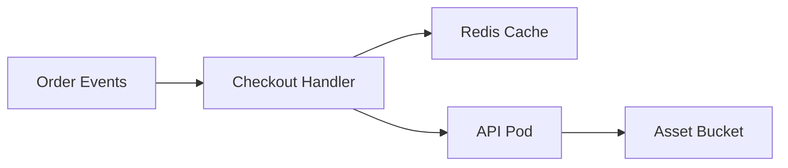

# Custom Architecture Node Shapes - Implementation Plan

Plan for adding five architecture-native custom node silhouettes to ArchDraw:

- Queue / Topic
- Cache
- Serverless Function
- Container / Pod
- Storage Bucket

This plan follows the current ArchDraw shape contract:

- Shape semantics live in `frontend/lib/shapeRegistry.ts`.
- Geometry lives in `frontend/lib/theme/shapeGeometry/index.ts`.
- Canvas and SVG export must render from the same primitives via `getShapePrimitives`.
- Mermaid round-trip uses native Mermaid syntax where available and `%% archdraw-shape` directives for ArchDraw-only shapes.
- Sizing stays on the optical grid from `frontend/lib/utils/nodeSizing.ts`.

## Goals

1. Make common architecture roles scannable without relying only on labels or icons.
2. Keep canvas, SVG export, sketch render style, Mermaid import/export, AI generation, templates, and repo diagrams in sync.
3. Avoid divergent shape paths in `ShapeNode.tsx`, `svgExport.ts`, or helper SVG utilities.
4. Preserve existing diagrams by treating old `cylinder` queue/cache mappings as compatible fallbacks.

## Non-Goals

- Replacing service icons or brand logos.
- Changing the dynamic handle system.
- Changing canonical LR/TB layout from Mermaid to Dagre.
- Adding new layout engines.
- Adding paid-tier or quota behavior.
- Adding decorative marketing-style shapes unrelated to system diagrams.

## Shape Set

| Shape | ShapeType | Primary meaning | Initial services |
|-------|-----------|-----------------|------------------|
| Queue / Topic | `queue` | Async stream, topic, queue, event bus | `queue`, `kafka`, `rabbitmq`, `sqs`, `sns`, `pubsub`, `eventbus`, `nats`, `kinesis` |
| Cache | `cache` | Fast temporary data, memory store, CDN cache | `cache`, `redis`, `memcached`, `elasticache`, `cdn`, `varnish` |
| Serverless Function | `function` | Stateless function, edge worker, scheduled handler | `function`, `lambda`, `cloudfunction`, `cloudfunctions`, `edgeworker`, `worker`, `scheduler`, `cronjob` |
| Container / Pod | `container` | Docker container, Kubernetes pod, workload unit | `docker`, `container`, `pod`, `kubernetes`, `k8s`, `deployment`, `service-mesh` |
| Storage Bucket | `bucket` | Object/blob storage | `storage`, `object-storage`, `s3`, `gcs`, `blob`, `azureblob`, `minio` |

## Visual Specs

### Queue / Topic

Use a horizontal message-lane silhouette, not the existing cylinder pipe.

Geometry:

- Outer rounded rectangle, roughly `240 x 64`.
- Three subtle internal horizontal lanes or staggered message strokes.
- Optional small chevron at the right edge to imply flow.
- Fillable outer primitive, stroke-only inner primitives.

Sizing:

- Width: 200-240 default, may opt into 280 for long Kafka topic names.
- Height: 56-72.
- Label band: 0.78.
- No icon stack by default unless brand icon is present.

Handles:

- Keep generic dynamic handles on all sides.
- Do not special-case left/right-only handles.

### Cache

Use a compact stacked memory/cache silhouette, distinct from database cylinders.

Geometry:

- Rounded rectangle body, `160-200 x 88-104`.
- Two or three offset stacked layers behind the main body.
- Small lightning/hash-like stroke inside only if it remains legible at small sizes.
- Fillable front body, stroke-only back layers.

Sizing:

- Width: 160-200.
- Height: 88-104.
- Label band: 0.7.

Migration note:

- Existing cache nodes currently use `diamond` or `cylinder` depending on path. New generation should use `cache`, but old diagrams with `diamond` or `cylinder` must still render unchanged.

### Serverless Function

Use a function-like block that reads differently from long-running compute.

Geometry:

- Compact rounded hexagon or rounded rectangle with angled side cuts.
- Internal small `fx`-style stroke is possible, but prefer pure geometry over text baked into the shape.
- Fillable outer primitive.

Sizing:

- Width: 160-200.
- Height: 88-104.
- Label band: 0.68.

Naming concern:

- TypeScript has `function` as a keyword, but string literal `ShapeType` values may safely use `'function'`.
- Avoid local variable names such as `function` in implementation; use `shape === 'function'` or `functionShapePrimitives`.

### Container / Pod

Use a nested workload silhouette.

Geometry:

- Main rounded rectangle body.
- Two or three small inset cells or package blocks inside the top/left area.
- For pods, consider a subtle double outline to imply a wrapper around containers.
- Fillable outer primitive, stroke-only inner cells.

Sizing:

- Width: 200-240.
- Height: 96-120.
- Label band: 0.76.

Semantic rule:

- Use this for runtime packaging/workload units, not generic compute services. A plain API service should remain `rounded-rectangle`.

### Storage Bucket

Use an object-storage bucket silhouette, distinct from database cylinder.

Geometry:

- Tapered bucket/trapezoid body with rounded top lip.
- Slight curved top rim.
- Fillable bucket body, stroke-only rim line.

Sizing:

- Width: 160-200.
- Height: 96-112.
- Label band: 0.72.

Migration note:

- Current generic `storage` maps to `cylinder`. Move object/blob storage services to `bucket`; keep relational and document stores on `cylinder`.

## Implementation Phases

## Phase 0 - Baseline Audit

Purpose: confirm current shape support before editing.

Files to inspect:

- `frontend/lib/shapeRegistry.ts`
- `frontend/lib/theme/shapeGeometry/index.ts`
- `frontend/components/ShapeNode.tsx`
- `frontend/lib/svgExport.ts`
- `frontend/lib/utils/shapeSilhouetteSvg.ts`
- `frontend/lib/utils/nodeSizing.ts`
- `frontend/constants/nodeShapeConfig.ts`
- `frontend/lib/mermaid/parse.ts`
- `frontend/lib/mermaid/buildReactFlow.ts`
- `frontend/lib/ai/pipeline/mermaid-pipeline/mermaidTranslator.ts`
- `frontend/lib/mermaid/planTranslator.ts`
- `frontend/components/PropertiesPanel.tsx`
- `frontend/components/ComponentSidebar.tsx`

Checklist:

- [ ] Confirm `ShapeType` is imported from `shapeRegistry.ts` wherever possible.
- [ ] Confirm `ShapeNode` renders bodies from `getShapePrimitives`.
- [ ] Confirm `svgExport.ts` does not have separate hard-coded geometry for these new shapes.
- [ ] Confirm tests that snapshot supported shape lists can be updated in one pass.

## Phase 1 - Extend Shape Registry

File: `frontend/lib/shapeRegistry.ts`

Tasks:

- [ ] Add new `ShapeType` literals:

```ts
| 'queue'
| 'cache'
| 'function'
| 'container'
| 'bucket'
```

- [ ] Add new config variants to `VARIANT_TO_SHAPE`:

```ts
QUEUE: 'queue',
CACHE: 'cache',
FUNCTION: 'function',
CONTAINER: 'container',
BUCKET: 'bucket',
```

- [ ] Add all five shapes to `SUPPORTED_SHAPES`.
- [ ] Keep all five out of `NATIVE_MERMAID_SHAPES` unless a native Mermaid syntax is deliberately chosen.
- [ ] Update `SERVICE_TYPE_TO_SHAPE`:

```ts
queue: 'queue',
kafka: 'queue',
rabbitmq: 'queue',
sqs: 'queue',
sns: 'queue',
pubsub: 'queue',
eventbus: 'queue',
nats: 'queue',
kinesis: 'queue',

cache: 'cache',
redis: 'cache',
memcached: 'cache',
elasticache: 'cache',
cdn: 'cache',
varnish: 'cache',

function: 'function',
lambda: 'function',
cloudfunction: 'function',
cloudfunctions: 'function',
edgeworker: 'function',
worker: 'function',
scheduler: 'function',
cronjob: 'function',

docker: 'container',
container: 'container',
pod: 'container',
kubernetes: 'container',
k8s: 'container',
deployment: 'container',

storage: 'bucket',
objectstorage: 'bucket',
'object-storage': 'bucket',
s3: 'bucket',
gcs: 'bucket',
blob: 'bucket',
azureblob: 'bucket',
minio: 'bucket',
```

Tests:

- [ ] Update `frontend/lib/__tests__/shapeRegistry.test.ts`.
- [ ] Assert all new shapes are supported.
- [ ] Assert all new shapes are directive-only.
- [ ] Assert representative service types resolve to the expected shapes.

## Phase 2 - Update Node Shape Config

File: `frontend/constants/nodeShapeConfig.ts`

Tasks:

- [ ] Add variants:

```ts
QUEUE
CACHE
FUNCTION
CONTAINER
BUCKET
```

- [ ] Remap service defaults:

```ts
queue/kafka/rabbitmq/sqs/sns/pubsub/eventbus/nats/kinesis -> QUEUE
cache/redis/memcached/elasticache/cdn/varnish -> CACHE
function/lambda/cloudfunction/worker/scheduler/cronjob -> FUNCTION
docker/container/pod/kubernetes/k8s/deployment -> CONTAINER
storage/s3/gcs/blob/azureblob/minio -> BUCKET
```

- [ ] Keep database services such as `postgres`, `mysql`, `mongodb`, `dynamodb`, `cassandra`, `sqlite`, `firestore`, and `supabase` on `CYLINDER`.
- [ ] Keep generic `service`, `api`, `compute`, and `server` on `ROUNDED_SQUARE`.

Suggested default dimensions:

| Variant | Width | Height |
|---------|-------|--------|
| `QUEUE` | 240 | 64 |
| `CACHE` | 180 | 96 |
| `FUNCTION` | 180 | 96 |
| `CONTAINER` | 220 | 104 |
| `BUCKET` | 180 | 104 |

Tests:

- [ ] Update any tests that assert config variant mappings.
- [ ] Add coverage that every new variant resolves through `shapeFromVariant`.

## Phase 3 - Add Geometry Primitives

File: `frontend/lib/theme/shapeGeometry/index.ts`

Tasks:

- [ ] Add switch cases in `getShapePrimitives`:

```ts
case 'queue':
  return queuePrimitives(W, H);
case 'cache':
  return cachePrimitives(W, H);
case 'function':
  return functionPrimitives(W, H);
case 'container':
  return containerPrimitives(W, H);
case 'bucket':
  return bucketPrimitives(W, H);
```

- [ ] Implement five primitive helper functions.
- [ ] Use existing primitive kinds only: `rect`, `rounded-rect`, `ellipse`, `polygon`, `path`, and `line`.
- [ ] Mark the main body primitive `fillable: true`.
- [ ] Mark decorative internal primitives `strokeOnly: true`.
- [ ] Use `strokeLinecap: 'round'` and `strokeLinejoin: 'round'` for softer architecture shapes.
- [ ] Avoid text glyphs inside geometry unless absolutely necessary.

Queue primitive sketch:

```ts
export function queuePrimitives(W: number, H: number): ShapePrimitive[] {
  const pad = 2;
  const r = Math.min(14, Math.round(H * 0.24));
  const laneY = [0.36, 0.5, 0.64].map((n) => Math.round(H * n));
  return [
    {
      kind: 'rounded-rect',
      bounds: { x: pad, y: pad, width: W - pad * 2, height: H - pad * 2 },
      rx: r,
      fillable: true,
    },
    ...laneY.map((y) => ({
      kind: 'line',
      bounds: { x: 0, y: 0, width: W, height: H },
      x1: Math.round(W * 0.16),
      y1: y,
      x2: Math.round(W * 0.76),
      y2: y,
      strokeOnly: true,
      strokeLinecap: 'round',
    })),
  ];
}
```

Testing:

- [ ] Update `frontend/lib/theme/shapeGeometry/__tests__/shapeGeometry.test.ts`.
- [ ] Assert each new shape returns at least one fillable primitive.
- [ ] Assert each shape stays within the passed bounds.
- [ ] Assert queue/cache/container include multiple primitives.

## Phase 4 - Wire Canvas Rendering

File: `frontend/components/ShapeNode.tsx`

Tasks:

- [ ] Ensure the local shape union accepts the five new `ShapeType` values or imports the shared type.
- [ ] Ensure `resolveShapeSize` supports label bands for all five shapes.
- [ ] Ensure `getShapePrimitives(shape, width, height, axis)` is the only body geometry source.
- [ ] Ensure the new shapes get the same surface treatment as existing semantic silhouettes.
- [ ] Decide icon behavior:
  - Queue: icon optional, label-first.
  - Cache: brand icon allowed for Redis/Memcached.
  - Function: brand icon allowed for Lambda/Cloud Functions.
  - Container: brand icon allowed for Docker/Kubernetes.
  - Bucket: brand icon allowed for S3/GCS/Azure Blob.
- [ ] Confirm selection, hover, resize, inline label edit, and handles still work.

CSS:

- [ ] Update `frontend/components/nodes/nodeStyles.css` only if text bands or sketch-specific scopes need tweaks.
- [ ] Do not add shape-specific hard-coded colors.
- [ ] Keep sketch selectors under `[data-render-style='sketch']`.

Manual QA:

- [ ] Add one of each shape to the canvas.
- [ ] Toggle precision/sketch render style.
- [ ] Drag nodes, connect edges on all sides, edit labels.
- [ ] Confirm handles remain centered or split by dynamic slot rules.

## Phase 5 - Update Sizing

File: `frontend/lib/utils/nodeSizing.ts`

Tasks:

- [ ] Extend `ShapeFit` with:

```ts
| 'queue'
| 'cache'
| 'function'
| 'container'
| 'bucket'
```

- [ ] Add text bands:

```ts
queue: 0.78,
cache: 0.7,
function: 0.68,
container: 0.76,
bucket: 0.72,
```

- [ ] Add height factors:

```ts
queue: 1,
cache: 1.08,
function: 1.08,
container: 1.08,
bucket: 1.1,
```

- [ ] Add max widths:

```ts
queue: SIZE_L,
cache: SIZE_M,
function: SIZE_M,
container: SIZE_L,
bucket: SIZE_M,
```

- [ ] Add min widths:

```ts
queue: SIZE_M,
cache: SIZE_S,
function: SIZE_S,
container: SIZE_M,
bucket: SIZE_S,
```

- [ ] Add height ranges:

```ts
queue: { min: 56, max: 72 },
cache: { min: 88, max: 104 },
function: { min: 88, max: 104 },
container: { min: 96, max: 120 },
bucket: { min: 96, max: 112 },
```

- [ ] Update `normalizeShape`.
- [ ] Remove or limit old horizontal-cylinder special casing for queues after `queue` is in use.
- [ ] Keep `cylinderAxis` support for backward compatibility with old queue diagrams.

Tests:

- [ ] Update `frontend/lib/utils/__tests__/nodeSizing.test.ts`.
- [ ] Add tests for short and long labels for all five shapes.
- [ ] Assert dimensions remain in the expected min/max bands.
- [ ] Assert long queue/topic labels wrap or widen within the allowed grid.

## Phase 6 - SVG Export and Shape Utility Parity

Files:

- `frontend/lib/svgExport.ts`
- `frontend/lib/utils/shapeSilhouetteSvg.ts`
- `frontend/lib/utils/__tests__/shapeSilhouetteSvg.test.ts`
- `frontend/lib/__tests__/svgExport.test.ts`

Tasks:

- [ ] Add the five new shapes to `SEMANTIC_SHAPES` in `shapeSilhouetteSvg.ts` if that helper is still the semantic export gate.
- [ ] Confirm `svgExport.ts` renders all five via `getShapePrimitives`.
- [ ] Ensure sketch export uses rough rendering for the new shapes.
- [ ] Ensure precision export uses crisp primitives.
- [ ] Avoid separate hard-coded SVG body functions unless legacy tests require named exports.

Tests:

- [ ] Add shape body SVG smoke tests for the five new shapes.
- [ ] Add SVG export test that exports a small graph containing all five shapes.
- [ ] Assert exported SVG includes body markup for each shape and does not fall back to rectangle.

## Phase 7 - Mermaid Round-Trip

Files:

- `frontend/lib/mermaid/parse.ts`
- `frontend/lib/mermaid/buildReactFlow.ts`
- `frontend/lib/ai/pipeline/mermaid-pipeline/mermaidTranslator.ts`
- `frontend/lib/mermaid/parse.test.ts`
- `frontend/lib/ai/pipeline/mermaid-pipeline/__tests__/mermaidTranslator.test.ts`

Transport decision:

- Use `%% archdraw-shape` directives for all five new shapes in v1.
- Do not invent Mermaid-native syntax for these unless Mermaid has a stable native equivalent.

Example Mermaid:



Tasks:

- [ ] Ensure `SUPPORTED_SHAPES` validation accepts all five directive values.
- [ ] Ensure parser records shape overrides for all five.
- [ ] Ensure `buildReactFlow.ts` applies `pNode.shapeOverride`.
- [ ] Ensure `reactFlowToMermaid` emits directives for all five via `isDirectiveOnlyShape`.
- [ ] Ensure round-trip preserves shape values.

Tests:

- [ ] Parse Mermaid directives for all five shapes.
- [ ] Build React Flow objects and assert `node.data.shape`.
- [ ] Serialize back to Mermaid and assert directives are emitted.
- [ ] Round-trip graph with groups and nested nodes.

## Phase 8 - AI Classification and Planner Guidance

Files:

- `frontend/lib/mermaid/planTranslator.ts`
- `frontend/lib/ai/pipeline/mermaid-pipeline/architecturePlanner.ts`
- `frontend/lib/ai/pipeline/mermaid-pipeline/conceptTemplates.ts`
- `frontend/lib/ai/pipeline/mermaid-pipeline/pipeline-v2.ts`
- `frontend/lib/repo-diagram/pipeline-stages/ClassifyStage.ts`
- `frontend/lib/repo-diagram/pipeline-stages/FinalizationStage.ts`

Tasks:

- [ ] Update `classifyNode` to return service types that map to the new shapes.
- [ ] Add planner guidance:
  - Use queue for async streams, message buses, event topics, and task queues.
  - Use cache for Redis/Memcached/CDN cache, not databases.
  - Use function for Lambda, cloud functions, webhooks, scheduled functions, and edge workers.
  - Use container for Docker/Kubernetes workload units.
  - Use bucket for object/blob storage, not relational/document databases.
- [ ] Update concept templates where relevant:
  - Kafka architecture: topics should be `queue`.
  - Cache architecture: Redis should be `cache`.
  - Serverless architecture: handlers should be `function`.
  - Kubernetes architecture: pods should be `container`.
  - Object storage/CDN architecture: S3/GCS/blob should be `bucket`.
- [ ] Update repo diagram classification so package managers, Dockerfiles, k8s manifests, queue clients, cache clients, and storage SDKs map correctly.

Tests:

- [ ] Add or update `planTranslator` tests for representative labels.
- [ ] Update concept-template snapshots that intentionally change.
- [ ] Add repo classification unit tests where existing test structure allows.

## Phase 9 - Editor Palette and Properties

Files:

- `frontend/components/PropertiesPanel.tsx`
- `frontend/components/ComponentSidebar.tsx`
- `frontend/components/CommandPalette.tsx`
- `frontend/lib/componentRegistry.ts`
- `frontend/data/components.json`
- `frontend/data/aws-components.json`
- `frontend/data/services-components.json`
- `frontend/lib/componentPorts.ts`
- `frontend/lib/factory.ts`

Tasks:

- [ ] Add shape picker entries under a semantic group:

```text
Semantic
- Queue / Topic
- Cache
- Function
- Container / Pod
- Bucket
```

- [ ] Add or remap component palette items:
  - Kafka Topic, Message Queue, Event Bus -> `queue`
  - Redis Cache, CDN Cache -> `cache`
  - Lambda, Cloud Function, Edge Worker -> `function`
  - Docker Container, Kubernetes Pod -> `container`
  - S3 Bucket, GCS Bucket, Blob Storage -> `bucket`
- [ ] Update port hints in `componentPorts.ts` if specific new component keys are added.
- [ ] Ensure manually changing a node shape persists through store partialization.

Manual QA:

- [ ] Create each shape through the palette.
- [ ] Change an existing node to each shape through properties.
- [ ] Save/reload canvas as guest if localStorage path is relevant.
- [ ] Save/reload authenticated canvas if DB env is available.

## Phase 10 - Persistence, Import, and Backward Compatibility

Files:

- `frontend/store/diagram/types.ts`
- `frontend/store/diagram/persistence/partialize.ts`
- `frontend/store/diagram/slices/graphSlice.ts`
- `frontend/lib/utils/importRepoDiagram.ts`
- `frontend/lib/db.ts`
- Share/embed viewers:
  - `frontend/components/SharedCanvasViewer.tsx`
  - `frontend/app/share/`
  - `frontend/app/embed/`

Tasks:

- [ ] Ensure the store type accepts the five shapes.
- [ ] Ensure persistence includes `data.shape` as-is.
- [ ] Ensure import normalization does not rewrite unknown semantic shapes to rectangles.
- [ ] Preserve old diagrams:
  - old `queue` rendered as horizontal cylinder should still render if `shape: 'cylinder', cylinderAxis: 'horizontal'`.
  - old `cache` rendered as `diamond` should still render.
  - old `storage` rendered as `cylinder` should still render.
- [ ] No migration required unless persisted invalid shape values are discovered.

Compatibility policy:

- Existing persisted diagrams remain visually stable.
- New generation and new palette usage prefer the new semantic shapes.
- Export/import round-trip preserves whichever shape the diagram already uses.

## Phase 11 - Tests and Verification

Run from `frontend/`.

Targeted tests:

```bash
npm test -- frontend/lib/__tests__/shapeRegistry.test.ts
npm test -- frontend/lib/theme/shapeGeometry/__tests__/shapeGeometry.test.ts
npm test -- frontend/lib/utils/__tests__/nodeSizing.test.ts
npm test -- frontend/lib/utils/__tests__/shapeSilhouetteSvg.test.ts
npm test -- frontend/lib/mermaid/parse.test.ts
npm test -- frontend/lib/ai/pipeline/mermaid-pipeline/__tests__/mermaidTranslator.test.ts
npm test -- frontend/lib/__tests__/svgExport.test.ts
```

Broader checks:

```bash
npm test
npx tsc --noEmit
npm run lint
```

Manual visual QA:

- [ ] Start dev server with `npm run dev`.
- [ ] Add all five shapes to a blank canvas.
- [ ] Connect each shape to at least two nodes.
- [ ] Toggle LR/TB layout.
- [ ] Toggle precision/sketch render style.
- [ ] Export SVG.
- [ ] Export PNG.
- [ ] Copy Mermaid from Mermaid panel, re-import, and confirm shape preservation.
- [ ] Open a shared/embed view if the app has the required env.

## Phase 12 - Rollout Order

Recommended implementation order:

1. Registry, config, sizing, geometry.
2. Canvas rendering and SVG export.
3. Mermaid parse/build/serialize tests.
4. Editor palette/properties.
5. AI and repo classification.
6. Concept templates.
7. Visual QA and full test pass.

Reasoning:

- Geometry and sizing unblock rendering.
- Mermaid round-trip should be stable before AI starts emitting the shapes.
- Palette can ship before AI mapping if necessary, but AI should not emit shapes until parse/export paths are proven.

## Acceptance Criteria

- [ ] `ShapeType` includes `queue`, `cache`, `function`, `container`, and `bucket`.
- [ ] Each shape renders on canvas in precision and sketch styles.
- [ ] Each shape exports to SVG without falling back to rectangle.
- [ ] Each shape is accepted in `%% archdraw-shape` Mermaid directives.
- [ ] React Flow to Mermaid serialization emits directives for all five.
- [ ] Mermaid round-trip preserves all five shapes.
- [ ] Node sizing tests cover all five shapes.
- [ ] Shape geometry tests cover all five shapes.
- [ ] Shape registry tests cover service-type mapping for all five.
- [ ] Palette/properties can create or select all five.
- [ ] AI classification maps common services to the new shapes.
- [ ] Existing diagrams using old cylinder/diamond queue/cache/storage shapes remain valid.

## Risks and Mitigations

| Risk | Mitigation |
|------|------------|
| Shape paths drift between canvas and export | Keep all geometry in `shapeGeometry/index.ts`; render primitives everywhere. |
| Mermaid syntax becomes non-portable | Use ArchDraw directives for v1. |
| Palette gets too crowded | Group new shapes under `Semantic`; avoid duplicate vendor-specific shape entries. |
| Cache vs database confusion | Map Redis/Memcached/CDN cache to `cache`; keep persistent databases on `cylinder`. |
| Function shape conflicts with TypeScript keyword | Use string literal `'function'`; name helpers `functionPrimitives` or `serverlessFunctionPrimitives`. |
| Old diagrams visually change unexpectedly | Do not migrate existing `shape` values; only change new classification/config defaults. |
| Sketch render hachure looks noisy on detailed shapes | Keep decorative primitives stroke-only and minimal; test dark and light sketch paper. |

## Open Decisions

1. Should the shape value be `function` or `serverless-function`?
   - Recommendation: use `function` for shorter persisted data and broad applicability.

2. Should queue replace horizontal cylinder entirely?
   - Recommendation: new nodes use `queue`; keep horizontal cylinder as backward-compatible legacy rendering.

3. Should CDN be `cache` or `cloud`?
   - Recommendation: CDN provider/service nodes can remain `cloud`; CDN cache nodes should be `cache`.

4. Should Kubernetes service be `container`?
   - Recommendation: pods/deployments/containers use `container`; Kubernetes service/gateway can stay rounded or hexagon depending on role.

5. Should object storage generic `storage` become `bucket`?
   - Recommendation: yes for new generation, but database-like stores remain `cylinder`.

## Suggested PR Breakdown

PR 1: Shape Core

- `shapeRegistry.ts`
- `nodeShapeConfig.ts`
- `nodeSizing.ts`
- `shapeGeometry/index.ts`
- unit tests

PR 2: Render and Export

- `ShapeNode.tsx`
- `nodeStyles.css` if needed
- `shapeSilhouetteSvg.ts`
- `svgExport.ts`
- visual/export tests

PR 3: Mermaid Round-Trip

- `parse.ts`
- `buildReactFlow.ts`
- `mermaidTranslator.ts`
- parse/translator tests

PR 4: Editor and AI Adoption

- properties/palette/sidebar/command palette
- `planTranslator.ts`
- planner guidance
- concept templates
- repo classification

