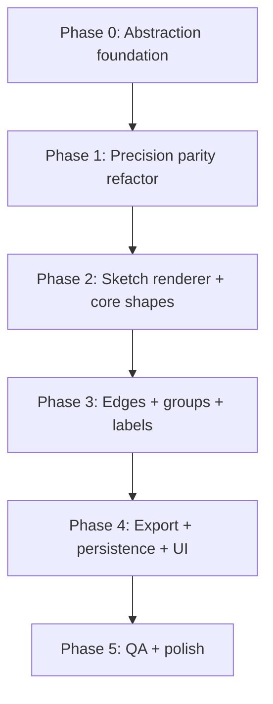

# Diagram Aesthetic Themes — Implementation Plan

Implementation plan for **one-click diagram aesthetic switching**: users change how the *canvas graph* looks (stroke style, typography, sizing feel) without changing diagram structure (nodes, edges, labels, layout, Mermaid IR, or app chrome).

**Initial scope:** two render styles:

| Style ID | Label | Description |
|----------|-------|-------------|
| `precision` | Precision (current) | Clean vectors, thin strokes, Inter typography, optical size grid — today’s default |
| `sketch` | Sketch | Hand-drawn / whiteboard feel — wobbly strokes, casual type, optional hachure fills |

This plan is complementary to `docs/architecture-visual-system-plan.md`, which covers **color theme packs** (`default`, `slate`, `forest-green`, …). Aesthetic themes are a separate axis.

---

## Goal

Users can switch diagram aesthetics in **one click** and instantly see every element on the canvas update — nodes, groups, edges, edge labels, annotations, free text — while **nothing outside the React Flow viewport changes** (toolbar chrome, sidebar, properties panel, modals, landing page, dashboard).

**Target outcomes:**

1. A stable **render-style abstraction** that all canvas renderers and export paths share.
2. `precision` remains pixel-identical to today (regression-safe default).
3. `sketch` reads as hand-drawn (Excalidraw / tldraw whiteboard quality, not a cheap CSS filter).
4. Theme switch is **instant** (no relayout, no AI regen, no node/edge data mutation).
5. SVG/PNG export matches what users see on canvas.
6. Future styles (blueprint, neon, minimal poster, …) plug in without rewriting node components.

**Non-goals:**

- Changing diagram topology, Mermaid source, or Dagre positions on theme switch.
- Restyling app UI (editor chrome, landing, dashboard) — only the graph layer.
- Replacing existing **color** theme packs or merging them into render styles.
- Hand-editing individual node “sketchiness” per node (global style only in v1).
- MCP tool contract changes in v1 (export should still work via canvas capture).

---

## Terminology (avoid confusion)

ArchDraw already has two different “theme” concepts. This plan introduces a third dimension explicitly:

| Concept | Store key (proposed) | What it controls | Examples |
|---------|----------------------|------------------|----------|
| **App theme** | `darkMode` + `next-themes` | Editor chrome light/dark | Light toolbar, dark canvas bg |
| **Color theme pack** | `diagramStyleTheme` (existing) | Stroke/fill **palette**, concern accents, edge colors | `slate`, `forest-green`, `luxury` |
| **Render / aesthetic style** | `diagramRenderStyle` (new) | **How** shapes are drawn — stroke engine, fonts, shadows, size nudges | `precision`, `sketch` |

**Resolved canvas appearance** = `diagramRenderStyle` × `diagramStyleTheme` × `darkMode`.

```
┌─────────────────────────────────────────────────────────────┐
│  Editor chrome (Toolbar, Sidebar, Properties) — UNCHANGED   │
├─────────────────────────────────────────────────────────────┤
│  React Flow viewport (.react-flow)                          │
│    data-render-style="sketch"                               │
│    data-color-theme="slate"                                 │
│    ┌─────────┐  sketch edge    ┌─────────┐                │
│    │ sketch  │ ───────────────► │ sketch  │                │
│    │  node   │                  │  node   │                │
│    └─────────┘                  └─────────┘                │
│    sketch group box, sketch labels, sketch annotations      │
└─────────────────────────────────────────────────────────────┘
```

Do **not** overload `diagramStyleTheme` with sketch metadata — color packs are already consumed by the AI planner (`architecturePlanner.ts`), concept templates, and `diagramThemeCssVars()`. Mixing render engines into color IDs would break planner JSON and persisted canvases.

---

## Diagnosis (current state)

| Area | Today | Gap for aesthetic themes |
|------|-------|--------------------------|
| Tokens | `stylingConstants.ts` — sizes, strokes, fonts, color packs | No render-engine dimension; stroke width / radius are global constants |
| Nodes | `ShapeNode.tsx` — mix of CSS `border` divs + inline SVG paths | Shapes hard-code crisp geometry; no pluggable stroke renderer |
| System cards | `SystemNode.tsx` + `nodeStyles.css` | CSS borders/shadows; sketch needs alternate surface path |
| Groups | `GroupNode.tsx` | Solid hairline `border`; sketch needs rough rect |
| Edges | `SimpleFloatingEdge.tsx` | SVG `<path>` with smoothstep; no wobble |
| Labels | `EdgeLabel.tsx`, `TextLabelNode.tsx`, `AnnotationNode.tsx` | Inter / system fonts |
| Export | `svgExport.ts` + `shapeSilhouetteSvg.ts` | Duplicated crisp SVG builders — must share abstraction with canvas |
| Sizing | `nodeSizing.ts` | Single grid; sketch may need padding multipliers |
| State | `diagramStyleTheme` in `uiSlice.ts`, persisted | No render-style field |
| UI | No user-facing style switcher in Toolbar | Need one-click control scoped to canvas |

**Key architectural debt:** shape geometry is authored in **three places** — React components (`ShapeNode.tsx`), export helpers (`shapeSilhouetteSvg.ts`), and partially `svgExport.ts`. Any aesthetic system must centralize the *drawing contract* before adding a second renderer.

---

## Target architecture

### Layer 1 — `DiagramRenderStyle` registry

New module: `frontend/lib/theme/renderStyles/`

```
frontend/lib/theme/renderStyles/
├── types.ts              # DiagramRenderStyleId, ResolvedRenderTokens
├── registry.ts           # RENDER_STYLES map + getRenderStyle()
├── precision.ts          # maps current behavior 1:1
├── sketch.ts             # rough.js options, font overrides, size nudges
├── resolveTokens.ts      # merge renderStyle × colorTheme × isDark
├── strokeRenderer/
│   ├── types.ts          # StrokeRenderer interface
│   ├── crispRenderer.ts  # today: plain SVG / CSS borders
│   └── roughRenderer.ts  # rough.js wrapper (canvas + export)
└── __tests__/
    ├── resolveTokens.test.ts
    └── roughRenderer.test.ts
```

#### `DiagramRenderStyleId`

```ts
export type DiagramRenderStyleId = 'precision' | 'sketch';
```

#### `RenderStylePack` (per aesthetic style)

```ts
export interface RenderStylePack {
  id: DiagramRenderStyleId;
  label: string;
  description: string;

  /** Which stroke engine draws primitives */
  strokeEngine: 'crisp' | 'rough';

  /** rough.js options — only when strokeEngine === 'rough' */
  roughOptions?: {
    roughness: number;       // sketch: ~1.2–1.8
    bowing: number;          // sketch: ~0.8–1.2
    strokeWidth: number;     // sketch: ~1.5–2
    fillStyle: 'hachure' | 'solid' | 'zigzag';
    fillWeight?: number;
    hachureAngle?: number;
    hachureGap?: number;
    disableMultiStroke?: boolean;
    preserveVertices?: boolean;
  };

  /** Typography overrides (canvas labels only) */
  fonts: {
    title: string;
    subtitle: string;
    edgeLabel: string;
    annotation: string;
    /** Google Fonts URL slug or local @font-face family */
    googleFontFamily?: string;
  };

  /** Geometry feel — applied on top of optical grid */
  geometry: {
    borderRadiusScale: number;   // precision: 1, sketch: 1.15 (softer corners)
    strokeWidthScale: number;    // precision: 1, sketch: 1.2
    labelPaddingX: number;       // extra px inside shapes for wobble clearance
    labelPaddingY: number;
    sizeGridNudge: number;         // sketch: +0 or +8px width snap bias
    dropShadow: 'none' | 'soft' | 'sketch'; // sketch: none or very subtle
  };

  /** Edge-specific */
  edges: {
    pathStyle: 'orthogonal' | 'orthogonal-sketch'; // same routing, different stroke
    arrowheadStyle: 'triangle' | 'hand-drawn';
    labelBackground: 'pill' | 'none' | 'sketch-box';
    animatedAsync: boolean;  // sketch: false (dashed wobble + animation looks noisy)
  };

  /** Group / subgraph chrome */
  groups: {
    borderStyle: 'solid' | 'rough-solid' | 'rough-dashed';
    labelStyle: 'tag' | 'handwritten';
    fillOpacity: number;
  };

  /** Icon treatment inside nodes */
  icons: {
  /** Brand logos stay sharp in v1; optional light opacity reduction in sketch */
    mode: 'sharp' | 'sharp-muted';
    mutedOpacity?: number;
  };
}
```

#### `StrokeRenderer` interface (core abstraction)

All primitives flow through one interface so canvas and export stay aligned:

```ts
export interface ShapePrimitive {
  kind: 'rect' | 'rounded-rect' | 'ellipse' | 'polygon' | 'path' | 'line' | 'polyline';
  // normalized geometry in local node coordinates (0,0) → (width, height)
  bounds: { x: number; y: number; width: number; height: number };
  points?: string;          // for polygon / path
  rx?: number;
  fill?: string;
  stroke?: string;
  strokeWidth?: number;
  dasharray?: string;
}

export interface StrokeRenderer {
  readonly engine: 'crisp' | 'rough';

  /** Stable seed derived from node/edge id — wobble stays consistent across re-renders */
  seedFor(id: string): number;

  renderPrimitive(primitive: ShapePrimitive, seed: number): string; // inner SVG markup
  renderEdgePath(d: string, opts: EdgeStrokeOpts, seed: number): string;
  renderArrowhead(tip: Point, angle: number, color: string, seed: number): string;
}
```

**`precision` renderer:** returns today’s exact SVG strings / equivalent CSS (regression baseline).

**`sketch` renderer:** uses [`roughjs`](https://roughjs.com/) (`rough.svg`) to generate `<path>` elements from the same `ShapePrimitive` inputs.

> **Why rough.js:** battle-tested (Excalidraw ecosystem), works in browser + Node for export, supports hachure fills, deterministic seeds, and outputs standalone SVG paths (no canvas bitmap). Alternatives considered: `perfect-freehand` alone (stroke only, no fills), CSS `filter: url(#turbulence)` (low quality, hard to export), pre-baked sketch SVG assets (not scalable per node size).

### Layer 2 — Shape geometry catalog (shared, style-agnostic)

Extract **geometry only** from `ShapeNode.tsx` into:

`frontend/lib/theme/shapeGeometry/`

```
shapeGeometry/
├── types.ts
├── rectangle.ts
├── diamond.ts
├── cylinder.ts
├── cloud.ts
├── hexagon.ts
├── actor.ts
├── monitor.ts
├── mobile.ts
├── parallelogram.ts
├── circle.ts
├── dashedRectangle.ts
└── index.ts   # getShapePrimitives(shape, width, height, axis?) → ShapePrimitive[]
```

Each shape file returns an array of `ShapePrimitive` — no colors, no roughness. `ShapeNode` and `shapeSilhouetteSvg.ts` both call `getShapePrimitives()` then pass results to `StrokeRenderer`.

This is the highest-leverage refactor: **one geometry source, two (or more) renderers**.

### Layer 3 — `resolveCanvasTokens()` (single resolver)

New function used by every canvas consumer:

```ts
export function resolveCanvasTokens(opts: {
  renderStyleId: DiagramRenderStyleId;
  colorThemeId: DiagramThemeId;
  isDark: boolean;
}): ResolvedCanvasTokens {
  const render = getRenderStyle(opts.renderStyleId);
  const color = getDiagramTheme(opts.colorThemeId);
  const mode = opts.isDark ? color.dark : color.light;

  return {
    render,
    colors: mode,
    concerns: color.concerns,
    strokeWidth: STROKE_WIDTH * render.geometry.strokeWidthScale,
    borderRadius: BORDER_RADIUS * render.geometry.borderRadiusScale,
    fonts: render.fonts,
    cssVars: {
      ...diagramThemeCssVars(opts.colorThemeId, opts.isDark),
      '--arch-render-style': opts.renderStyleId,
      '--arch-font-title': render.fonts.title,
      '--arch-font-subtitle': render.fonts.subtitle,
      '--arch-stroke-width': `${STROKE_WIDTH * render.geometry.strokeWidthScale}px`,
      '--arch-radius': `${BORDER_RADIUS * render.geometry.borderRadiusScale}px`,
    },
    strokeRenderer: getStrokeRenderer(render.strokeEngine),
  };
}
```

Hook for components:

```ts
// frontend/lib/theme/useDiagramAesthetics.ts
export function useDiagramAesthetics() {
  const renderStyleId = useDiagramStore((s) => s.diagramRenderStyle);
  const colorThemeId = useDiagramStore((s) => s.diagramStyleTheme);
  const { isDark } = useCanvasTheme();
  return useMemo(
    () => resolveCanvasTokens({ renderStyleId, colorThemeId, isDark }),
    [renderStyleId, colorThemeId, isDark],
  );
}
```

### Layer 4 — Canvas application boundary

Only elements inside `.react-flow` (and export pipeline) consume `ResolvedCanvasTokens`.

**Apply at canvas root** (`Canvas.tsx`):

```tsx
<div
  className="react-flow"
  data-render-style={tokens.render.id}
  data-color-theme={colorThemeId}
  style={tokens.cssVars}
>
```

**CSS scoping** (`nodeStyles.css`):

```css
.react-flow[data-render-style='sketch'] .node-card {
  box-shadow: none;
  font-family: var(--arch-font-title);
}
.react-flow[data-render-style='sketch'] .node-title {
  font-family: var(--arch-font-title);
  letter-spacing: 0.01em;
}
```

App chrome (`Toolbar`, `PropertiesPanel`, …) does **not** set `data-render-style` and does not call `useDiagramAesthetics()`.

---

## Sketch style — visual specification

Design reference: Excalidraw whiteboard, tldraw sketch mode, classic architecture whiteboard photos — **imperfect but readable**, not cartoonish.

### Stroke & fill

| Element | Precision (today) | Sketch target |
|---------|-------------------|---------------|
| Node body stroke | 1.25px crisp, soft shadow | ~1.75px rough stroke, **no shadow** (or 1px soft neutral) |
| Node fill | Solid white / dark card | Light hachure at ~15–25% opacity **or** solid with slight paper tint `#fffef9` |
| Diamond / hexagon | Crisp polygon | Same points via `rough.polygon()` |
| Cylinder | Gradient drum | Simplified: rough outline + light hachure side (drop gradient in sketch v1) |
| Group border | 1px solid tint | Rough dashed rect, slightly heavier stroke |
| Edge | Smooth orthogonal path | Same waypoints, rough `linearPath` / segmented rough lines |
| Arrowhead | Closed triangle marker | Small rough triangle or open chevron |
| Selection ring | 2px accent | Rough accent rect (slightly larger padding) |
| Handles | Crisp circles | Keep crisp (edit chrome) OR tiny rough dots — **recommend crisp** for usability |

### Typography

| Role | Precision | Sketch |
|------|-----------|--------|
| Node title | Inter 13.5px / 600 | **Caveat** or **Patrick Hand** 15–16px / 600 |
| Subtitle | Inter 10.5px | Same family 12px / 400 |
| Edge label | Inter 11px | Hand font 12px, optional sketch rect behind text |
| Annotation / text nodes | System sans | Hand font; heading sizes map 1:1 |
| Group label | Sans tag | Handwritten, no pill background in sketch |

Load fonts once on editor mount when `diagramRenderStyle === 'sketch'`:

```ts
// next/font/google in Editor or Canvas layout wrapper — NOT global layout.tsx
import { Caveat } from 'next/font/google';
const sketchFont = Caveat({ subsets: ['latin'], weight: ['400', '600', '700'] });
```

Scope font CSS variable to `.react-flow[data-render-style='sketch']` so landing page and dashboard stay Inter.

### Sizing adjustments (sketch only)

Sketch strokes extend slightly outside nominal bounds. Compensate without relayout:

| Knob | Value | Rationale |
|------|-------|-----------|
| `labelPaddingX/Y` | +4px | Prevent label clipping against wobbly border |
| `sizeGridNudge` | 0 (v1) | Avoid relayout surprises; padding is enough |
| `SHAPE_TEXT_BAND` | unchanged | Geometry catalog unchanged |
| Icon slot | `sharp-muted` @ 0.92 opacity | Logos readable, slightly blended |

**Do not change node positions or edge waypoints on theme switch** — only internal padding and stroke overflow handling (`overflow: visible` on sketch shells).

### Color interaction

Sketch style uses the **same** `diagramStyleTheme` concern colors. Optional sketch-specific tweaks inside `sketch.ts`:

- Slightly desaturate fills (multiply alpha on concern bg).
- Edge default color: use `mode.edgeDefault` from color pack (no change).
- Paper tint on light mode node fill: `#fffef9` instead of pure `#ffffff` (only when `strokeEngine === 'rough'`).

### rough.js default options (starting point)

```ts
export const SKETCH_ROUGH_OPTIONS = {
  roughness: 1.4,
  bowing: 1.0,
  strokeWidth: 1.75,
  fillStyle: 'hachure' as const,
  fillWeight: 0.5,
  hachureAngle: 60,
  hachureGap: 5,
  disableMultiStroke: false,
  preserveVertices: false,
};
```

**Seed strategy:** `seed = hashString(nodeId || edgeId)` — same id always produces the same wobble (important for undo/redo, export, and screenshot stability). When a node is duplicated, it gets a new id → new wobble (acceptable).

---

## Component-by-component changes

### 1. `ShapeNode.tsx` (largest change)

**Today:** each shape function (`Rectangle`, `Diamond`, `Cylinder`, …) inlines CSS borders or SVG.

**Target:**

```tsx
function ShapeShell({ shape, width, height, id, ... }) {
  const tokens = useDiagramAesthetics();
  const primitives = getShapePrimitives(shape, width, height, data);
  const seed = tokens.strokeRenderer.seedFor(id);
  const surface = resolveShapeSurface(tokens, selected, accentColor);

  return (
    <div className="shape-node" style={{ width, height, overflow: 'visible' }}>
      <svg width={width} height={height} style={SVG_SURFACE_STYLE(width, height)}>
        {primitives.map((p, i) => (
          <g key={i} dangerouslySetInnerHTML={{
            __html: tokens.strokeRenderer.renderPrimitive({
              ...p,
              fill: surface.fill,
              stroke: surface.stroke,
              strokeWidth: surface.strokeWidth,
            }, seed),
          }} />
        ))}
      </svg>
      <Label ... /> {/* uses tokens.fonts */}
      <Handles ... />
    </div>
  );
}
```

Migrate shapes incrementally: `rectangle`, `rounded-rectangle`, `diamond`, `circle` first (80% of diagrams), then `cylinder`, `cloud`, `hexagon`, semantic silhouettes.

**Cylinder sketch v1 simplification:** single rough outline path + optional light hachure fill; skip 3-tone gradient until v2.

### 2. `SystemNode.tsx`

- Replace CSS `border` card with SVG rough rect **or** wrap existing `.node-card` in sketch overlay.
- **Recommended:** add inner `<svg>` rough rect behind content for sketch mode; keep DOM structure for edit toolbar compatibility.
- Left accent rail (`::before`): in sketch, draw as rough vertical stroke segment instead of CSS pseudo-element.

### 3. `GroupNode.tsx`

- Read `useDiagramAesthetics()`.
- Precision: unchanged CSS border.
- Sketch: SVG rough rounded-rect with `strokeLineDash` equivalent via rough dashed options; label uses hand font, transparent tag background.

### 4. `SimpleFloatingEdge.tsx` + `EdgeLabel.tsx`

- After `computeEdgeRoute()`, pass path `d` through `strokeRenderer.renderEdgePath()`.
- Replace `markerEnd` SVG marker with renderer-drawn arrowhead for sketch (markers don't roughify well).
- Sketch async edges: keep dash concept but use rough path + **disable animation** (`tokens.render.edges.animatedAsync === false`).
- Edge labels: conditionally render sketch background rect via renderer.

### 5. `AnnotationNode.tsx` + `TextLabelNode.tsx`

- Font family from `tokens.fonts.annotation` / title.
- Optional rough underline or box in sketch for callouts.
- Size estimation (`estimateTextNodeSize`) — add `fontFamily` parameter for hand fonts (wider glyphs); call from node with render style context.

### 6. `nodeStyles.css`

- Move render-specific rules under `[data-render-style='sketch']` selectors.
- Precision selectors remain default (no attribute required).

### 7. `shapeSilhouetteSvg.ts` + `svgExport.ts`

- Refactor to: `getShapePrimitives()` → `strokeRenderer` → SVG string.
- `generatePureSVG()` accepts `renderStyleId` (default `'precision'` for backward compat).
- Export toolbar passes store’s `diagramRenderStyle`.
- Embed/share viewer reads persisted `diagramRenderStyle` from canvas payload.

### 8. `nodeSizing.ts` (optional v1.1)

Add optional parameter:

```ts
calculateNodeDimensions(label, shape, opts?: { renderStyleId?: DiagramRenderStyleId })
```

When `sketch`, add `labelPaddingX/Y` from render pack to internal padding constants. **Do not** change width snap grid in v1 unless visual QA shows clipping.

### 9. Landing demo (`InteractiveLandingDemo.tsx`)

Out of scope for v1 — stays `precision`. Optional: marketing toggle later.

### 10. Tutorials (`TutorialCanvas.tsx`)

Inherit store render style or lock to `precision` until tutorial assets updated — **recommend inherit** so users see consistent style.

---

## State, persistence & API

### Zustand (`uiSlice.ts`)

```ts
diagramRenderStyle: DiagramRenderStyleId; // default: 'precision'
setDiagramRenderStyle: (style: DiagramRenderStyleId) => void;
```

Add to `diagramPersistPartialize` (`persistence/partialize.ts`) alongside `diagramStyleTheme`.

### Per-canvas vs global

**v1: global** (matches `diagramStyleTheme` behavior) — simpler one-click toggle, one persisted preference per user.

**v2 option:** move to `CanvasTab.diagramRenderStyle` for per-diagram style (useful for mixed portfolios). Not required for initial launch.

### Share / embed / DB

- Include `diagramRenderStyle` in persisted guest/auth canvas JSON.
- `SharedCanvasViewer` / embed route: apply `data-render-style` on React Flow root when loading payload.
- No Prisma migration if canvas JSON is schemaless — new field is additive.

### AI pipeline

**No change required** for v1 — planner continues emitting color `theme` only. Diagram generates in whatever render style the user has selected.

Optional later: planner hint `renderStyle` for template demos (non-goal v1).

---

## UI — one-click switcher

### Placement

`Toolbar.tsx` — canvas-adjacent control cluster (near layout direction / grid toggles), **not** in app settings.

### Interaction

| Control | Behavior |
|---------|----------|
| Segmented toggle or icon dropdown | `Precision` \| `Sketch` |
| Keyboard | Optional: none in v1 |
| Click | `setDiagramRenderStyle('sketch')` — instant, no confirm dialog |
| Tooltip | “Diagram style — changes canvas appearance only” |

### Preview chip (optional polish)

Tiny SVG swatch in dropdown showing rect + edge in each style.

### Accessibility

- `aria-pressed` on active segment.
- Labels not icon-only.

---

## Performance

| Risk | Mitigation |
|------|------------|
| rough.js per-node on 50-node canvas | Memoize `renderPrimitive()` output keyed by `(id, w, h, renderStyleId, colorThemeId, isDark)` |
| Re-render storm on theme toggle | Single store update; React Flow nodes re-render via context or `useDiagramAesthetics` — acceptable for <100 nodes |
| Edge path regen | Memoize per `(edgeId, waypoints hash, renderStyleId)` |
| Font load flash | Preload Caveat when editor mounts; fallback to `cursive` until loaded |
| PNG export | html-to-image captures DOM — sketch SVG must be in DOM (not canvas bitmap) ✓ |
| Bundle size | `roughjs` ~20KB gzipped — dynamic `import()` when user first selects sketch |

**Benchmark gate:** 50-node template theme switch < 200ms on M1 Air; pan/zoom 60fps after switch.

---

## Implementation phases



### Phase 0 — Abstraction foundation (no visible change)

| Task | Files |
|------|-------|
| Add `DiagramRenderStyleId`, `RenderStylePack`, registry | `lib/theme/renderStyles/*` |
| Implement `StrokeRenderer` crisp + rough stubs | `strokeRenderer/*` |
| Extract `getShapePrimitives()` for rectangle, diamond, circle | `lib/theme/shapeGeometry/*` |
| Add `resolveCanvasTokens()`, `useDiagramAesthetics()` | `lib/theme/useDiagramAesthetics.ts` |
| Add store field + persist | `uiSlice.ts`, `partialize.ts`, `types.ts` |
| Unit tests for token resolution + seeds | `__tests__` |

**Exit criteria:** `npm test` green; zero visual diff.

### Phase 1 — Precision parity refactor

| Task | Files |
|------|-------|
| Migrate `ShapeNode` rectangle/diamond/circle to geometry + crisp renderer | `ShapeNode.tsx` |
| Migrate `shapeSilhouetteSvg.ts` to same path | `shapeSilhouetteSvg.ts` |
| Snapshot tests: export SVG matches pre-refactor | `shapeSilhouetteSvg.test.ts`, `svgExport` tests |

**Exit criteria:** Visual regression none for default style; export byte-stable for fixtures.

### Phase 2 — Sketch renderer + core shapes

| Task | Files |
|------|-------|
| Add `roughjs` dependency | `package.json` |
| Implement `roughRenderer.ts` with seeds | `strokeRenderer/roughRenderer.ts` |
| Wire `sketch` pack options | `renderStyles/sketch.ts` |
| Enable sketch on rectangle, rounded-rect, diamond, circle, parallelogram | `ShapeNode.tsx` |
| Load Caveat / Patrick Hand scoped to canvas | `Editor.tsx` or `Canvas.tsx` |
| `data-render-style` on React Flow root | `Canvas.tsx` |

**Exit criteria:** 4-shape diagrams look hand-drawn; toggle works; handles still usable.

### Phase 3 — Edges, groups, remaining shapes

| Task | Files |
|------|-------|
| Rough edges + arrowheads | `SimpleFloatingEdge.tsx` |
| Sketch edge labels | `EdgeLabel.tsx` |
| Group rough borders | `GroupNode.tsx` |
| Cylinder, cloud, hexagon, actor, monitor, mobile, dashed-rect | `shapeGeometry/*`, `ShapeNode.tsx` |
| SystemNode sketch surface | `SystemNode.tsx` |
| Annotation + text label fonts | `AnnotationNode.tsx`, `TextLabelNode.tsx` |

**Exit criteria:** Full template library readable in sketch mode.

### Phase 4 — Export, share, UI

| Task | Files |
|------|-------|
| `generatePureSVG(..., renderStyleId)` | `svgExport.ts` |
| Toolbar switcher | `Toolbar.tsx` |
| Share/embed load render style | share routes, viewer components |
| Dynamic import roughjs on first sketch use | `roughRenderer.ts` |

**Exit criteria:** SVG export sketch matches canvas; shared links preserve style.

### Phase 5 — QA & polish

| Task | Notes |
|------|-------|
| Visual checklist | 3 templates × 2 color themes × 2 render styles × light/dark |
| Performance benchmark | 50-node canvas |
| Update `AGENTS.md` | Document render style vs color theme |
| Cross-link | `architecture-visual-system-plan.md`, `visual-vocabulary-implementation-plan.md` (remove “non-goal sketch” or mark superseded) |

---

## Testing strategy

### Unit tests

| Area | Test |
|------|------|
| `resolveCanvasTokens` | precision × slate × dark returns expected css vars |
| `seedFor(id)` | stable for same id, differs across ids |
| `roughRenderer` | rectangle primitive returns `<path` with rough attributes |
| `getShapePrimitives('diamond')` | point count / bounds match ShapeNode fixtures |

### Visual / snapshot

- `shapeSilhouetteSvg.test.ts` — golden SVG per shape × `precision` | `sketch`.
- Export integration: small 3-node graph PNG hash (loose) or SVG string snapshot.

### Manual QA checklist

- [ ] Theme toggle does not move nodes or re-run layout
- [ ] Undo/redo after theme switch restores graph (style is viewport preference, not history entry — **style change should NOT push undo stack**)
- [ ] Selection, drag, connect, inline edit work in sketch
- [ ] Primary vs async edge hierarchy still readable
- [ ] Group labels don’t overlap rough borders
- [ ] Dark mode sketch: sufficient contrast (WCAG AA for text)
- [ ] Share link opens with correct render style
- [ ] SVG export opens in Figma/browser with paths intact
- [ ] MCP `export-diagram` PNG still works

### Undo semantics

`setDiagramRenderStyle` is a **view preference** — do **not** add to diagram undo history (same as `toggleGrid`, `diagramStyleTheme`). Document this in store action.

---

## Dependency

```bash
cd frontend && npm install roughjs
```

Use `roughjs` (not `roughjs/bin/generator` only) — import `rough` from `roughjs/bundled/rough.esm.js` or package default per bundler.

TypeScript: `@types/roughjs` if needed or inline minimal types.

---

## Future extensions (out of v1 scope)

| Style | Approach |
|-------|----------|
| `blueprint` | Crisp renderer + blue monochrome palette + dashed grid snap |
| `sticky` | Rect renderer + yellow fill + tape shadow CSS |
| `presentation` | Larger size grid scale + bolder type (geometry scale 1.1) |
| Per-node override | `data.renderStyle` on node — only if enterprise asks |
| Animated sketch | Rough.js + stroke-dashoffset — likely too noisy |

Adding a third style = new `RenderStylePack` file + registry entry + QA row — **no ShapeNode rewrite**.

---

## File change summary

| File | Change |
|------|--------|
| `lib/theme/renderStyles/*` | **New** — registry, precision, sketch packs |
| `lib/theme/shapeGeometry/*` | **New** — shared primitives |
| `lib/theme/strokeRenderer/*` | **New** — crisp + rough engines |
| `lib/theme/useDiagramAesthetics.ts` | **New** — hook |
| `lib/theme/stylingConstants.ts` | Minor — cross-reference; keep color packs |
| `components/ShapeNode.tsx` | **Major** — use geometry + renderer |
| `components/SystemNode.tsx` | Medium |
| `components/GroupNode.tsx` | Medium |
| `components/edges/SimpleFloatingEdge.tsx` | Medium |
| `components/edges/EdgeLabel.tsx` | Small |
| `components/AnnotationNode.tsx` | Small |
| `components/TextLabelNode.tsx` | Small |
| `components/Canvas.tsx` | Small — `data-render-style`, css vars |
| `components/Toolbar.tsx` | Small — switcher UI |
| `components/nodes/nodeStyles.css` | Medium — scoped sketch rules |
| `lib/utils/shapeSilhouetteSvg.ts` | Medium — delegate to renderer |
| `lib/svgExport.ts` | Medium — `renderStyleId` param |
| `lib/utils/nodeSizing.ts` | Small (optional) |
| `store/diagram/slices/uiSlice.ts` | Small — new state |
| `store/diagram/persistence/partialize.ts` | Tiny |
| `store/diagram/types.ts` | Tiny |
| `AGENTS.md` | Doc update after ship |

---

## Open decisions (resolve before Phase 2)

| # | Question | Recommendation |
|---|----------|----------------|
| 1 | Hand font: Caveat vs Patrick Hand vs Virgil (Excalidraw) | **Caveat** — good at 12–16px, Google Fonts, OFL license |
| 2 | Sketch node fill: hachure vs solid paper | **Hachure** for rects; **solid** for small diamonds/circles (readability) |
| 3 | Cylinder sketch: full gradient vs simple outline | **Simple outline** v1 |
| 4 | Brand icons in sketch: sharp vs filtered | **Sharp, 0.92 opacity** |
| 5 | Global vs per-canvas render style | **Global** v1 |
| 6 | Include sketch in AI default generation? | **No** — user opt-in via toggle |

---

## Success metrics

- Users can switch Precision ↔ Sketch in one click with <200ms perceived latency.
- Zero layout shift on toggle (node positions identical).
- Sketch diagrams identifiable in user testing vs precision (“whiteboard feel”).
- SVG export parity: ≥95% visual match canvas screenshot (manual QA).
- No regression in precision mode golden tests.

---

## Related docs

- `docs/architecture-visual-system-plan.md` — color concerns, size grid, color theme packs (Step 7).
- `docs/visual-vocabulary-implementation-plan.md` — previously listed sketch as non-goal; superseded by this plan for render-style work.
- `AGENTS.md` § Design system — update after implementation with render-style canonical path.

---

## Progress

| Phase | Status | Notes |
|-------|--------|-------|
| 0 — Abstraction foundation | ✅ | Registry, packs, `shapeGeometry`, `resolveCanvasTokens`, store field + persist |
| 1 — Precision parity refactor | ✅ | ShapeNode geometry/crisp migration, `svgExport(renderStyleId)`, parity tests |
| 2 — Sketch core shapes | ✅ | rough renderer, Patrick Hand (dynamic load), `data-render-style` scoping, ShapeNode sketch bodies |
| 3 — Edges, groups, labels | ✅ | Rough edges + hand arrowheads, sketch edge labels (canvas knockout), dashed groups, SystemNode rough body via CSS-scoped overlay |
| 4 — Export, share, UI | ✅ | `generatePureSVG` sketch path, Toolbar toggle, share links preserve style via `?style=` |
| 5 — QA & polish | ✅ | tsc/eslint/tests green; SystemNode sketch bodies, edge-label knockout, dashed-edge de-noise, icon muting; manual visual checklist open |

### Implementation notes / deviations

- CSS scoping uses descendant selectors (`[data-render-style='sketch'] .node-card`) because `data-render-style` lives on the canvas wrapper (ancestor of `.react-flow`), not the `.react-flow` element itself. The plan's `.react-flow[data-render-style=...]` examples do not match the actual DOM.
- Patrick Hand is loaded via a lazy `<link>` (Google Fonts CSS2) only when sketch is active, instead of `next/font` — keeps the editor bundle and build simple; caching is browser-side.
- `roughjs` stays a static import in `roughRenderer.ts` (bundled with the app, ~20KB gzipped). A true dynamic `import()` on first sketch use was deferred: the sync `StrokeRenderer` API and pre-render race make it risky for little gain.
- Share/embed preserve style via `?style=sketch` on the share URL (viewer reads it, sets store + tokens) rather than a DB column — no Prisma migration. Old links (no param) default to precision.
- Cylinder in sketch uses the full `shapeGeometry` primitive set (gradients dropped, rough outline + hachure) — the plan's "simplified outline v1" approach.
- **SystemNode sketch body** (`SystemNode.tsx`): the card keeps its DOM structure, but a rough SVG rounded-rect overlay (same `shapeGeometry → rough renderer` path as ShapeNode) is rendered as a sibling that bleeds ~2px past the card, with `z-index` below the card. The crisp CSS `border` and the `::before` accent rail are hidden in sketch via descendant CSS — the rail is removed rather than re-drawn rough (simplification over the plan's rough-stroke rail; revisit if the missing accent reads wrong).
- **Edge labels in sketch** keep a canvas-colored knockout background (`hsl(var(--canvas-bg))`) — border and pill are removed, but the text still punches a readable gap over the wobbly line.
- **Async/dashed edges in sketch** are no longer double-distressed: `renderEdgePath` emits a single wobbly line with `stroke-dasharray` instead of letting rough.js re-segment the path (`dashGap: 0`), so semantic dashes + one layer of wobble only.
- **Icons in sketch** are muted to 0.92 opacity (`[data-render-style='sketch'] .node-icon-box`) so sharp vectors sit better next to handwriting.
