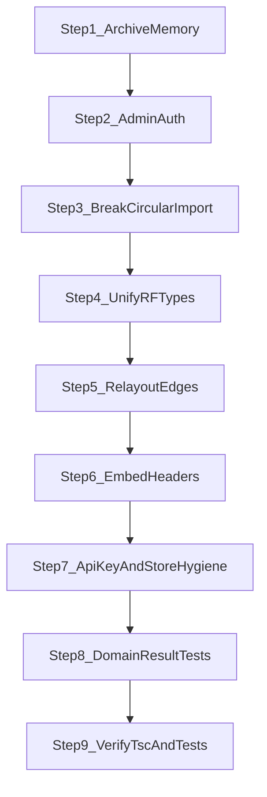

# Fix review defects (stepped)

Implementation plan for the defect-first review findings (archive OOM, admin session Map, RF type divergence, relayout edge loss, circular imports, embed headers, API/store hygiene, DomainResult tests).

## Defaults

- **Admin session Map:** remove it entirely; keep HMAC cookie + `ALLOWED_ADMIN_EMAIL` OAuth fallback.
- **Archive cache:** keep a small in-process cache with a **hard total byte budget (32MB LRU)** + per-entry size guard.

## Checklist

- [ ] Step 1: Byte-budgeted archive LRU cache (32MB) + tests
- [ ] Step 2: Remove in-memory admin session tracking; keep HMAC + email fallback
- [ ] Step 3: Extract skip-rules module; break github/tarball cycle
- [ ] Step 4: Use mermaid RF types in IntegratedLayout; fix layout/Elk/ExtractStage tsc
- [ ] Step 5: Preserve original edge metadata in relayout + tests
- [ ] Step 6: Deny-by-default embed CSP; remove invalid ALLOWALL
- [ ] Step 7: inUse floor, OpenRouter default revert, pushHistory after success
- [ ] Step 8: Narrow DomainResult in tests/fixtures
- [ ] Step 9: tsc + targeted vitest green



---

## Step 1 — Cap archive memory (P0)

**Files:** [frontend/lib/github-ingestion.ts](../frontend/lib/github-ingestion.ts), [frontend/lib/repo-diagram/tarball-ingestion.ts](../frontend/lib/repo-diagram/tarball-ingestion.ts)

- Track approximate byte size of each `archiveCache` entry (sum of string lengths or stored `bytes` field).
- Enforce:
  - max entry size (e.g. reject caching entries > 8–16MB; still usable for the current request)
  - max total cache bytes **32MB**
  - max entry count as a secondary guard (e.g. 4–8), not 25 unbounded extractions
- Evict LRU / insertion-order oldest until under budget (replace current size-only `evictIfNeeded`).
- Add a unit test that inserts oversized maps and asserts eviction / non-retention.

---

## Step 2 — Fix admin auth binding (P1)

**Files:** [frontend/lib/admin-auth.ts](../frontend/lib/admin-auth.ts), [frontend/lib/admin-session-tracking.ts](../frontend/lib/admin-session-tracking.ts), [frontend/app/api/admin/login/route.ts](../frontend/app/api/admin/login/route.ts), [frontend/lib/env-validation.ts](../frontend/lib/env-validation.ts)

- Delete / stop using `admin-session-tracking` (`Map` is wrong on serverless).
- Remove `trackAdminSession` / UA mismatch checks from login + `verifyAdminSession`.
- Keep HMAC cookie + expiry as the real session control.
- Keep OAuth fallback only when `ALLOWED_ADMIN_EMAIL` is set via `validateAdminConfig()`.
- In production, if admin passcode/session secret are configured but `ALLOWED_ADMIN_EMAIL` is missing, log a clear warning (do not re-hardcode the old email).
- Leave `sameSite: 'strict'` in production (correct for same-site admin login).

---

## Step 3 — Break ingestion circular import (P1)

**New file:** `frontend/lib/repo-diagram/skip-rules.ts` (or similar)

- Move `isSkipped`, `MAX_FILE_SIZE_BYTES`, `SKIPPED_DIRECTORIES`, and related skip constants out of [github-ingestion.ts](../frontend/lib/github-ingestion.ts).
- Update imports in:
  - [github-ingestion.ts](../frontend/lib/github-ingestion.ts)
  - [tarball-ingestion.ts](../frontend/lib/repo-diagram/tarball-ingestion.ts)
  - any tests that import `isSkipped` from github-ingestion

---

## Step 4 — Unify RF graph types so layout `tsc` passes (P1)

**Canonical types:** keep [frontend/lib/mermaid/types.ts](../frontend/lib/mermaid/types.ts) as the source of truth (already used by adapters, stages, converters).

**Change:** [frontend/lib/pipeline-shared/layout/IntegratedLayout.ts](../frontend/lib/pipeline-shared/layout/IntegratedLayout.ts)

- Remove local duplicate `RFNode` / `RFEdge` / `RFObjects`.
- Import those types from `@/lib/mermaid/types`.
- Make `applyRfLayout` / `applyRfLayoutAsync` accept and return `RFObjects` from mermaid types (no `as RFObjects` cast in [layout.ts](../frontend/lib/mermaid/layout.ts) / [LayoutStage.ts](../frontend/lib/mermaid/pipeline-stages/LayoutStage.ts)).
- Fix [ElkLayout.ts](../frontend/lib/pipeline-shared/layout/ElkLayout.ts) cast via `unknown` if needed so non-test production files typecheck.
- Narrow `repoProfile` in [ExtractStage.ts](../frontend/lib/repo-diagram/pipeline-stages/ExtractStage.ts) (`if (!repoProfile) return successResult(input)` or assert after `useLlm`) so nullability is honest.

---

## Step 5 — Preserve edges in Mermaid relayout (P1)

**File:** [frontend/lib/mermaid/relayout.ts](../frontend/lib/mermaid/relayout.ts)

- After pipeline success, map new edges back onto originals by `id`, then fallback `source+target` (+ handles if present).
- Preserve from original: `type`, `label`, `data`, `style`, `animated`, `markerStart`/`markerEnd`, `sourceHandle`/`targetHandle`, z-index, etc.
- Apply pipeline-only updates that matter for layout (e.g. regenerated edge path metadata if any).
- Keep orphan original edges that the pipeline dropped (same pattern as orphan nodes).
- Add/extend [frontend/lib/mermaid/relayout.test.ts](../frontend/lib/mermaid/relayout.test.ts) covering custom edge `data`/`type` survival across LR↔TD.

---

## Step 6 — Embed / frame header hygiene (P2)

**Files:** [frontend/next.config.ts](../frontend/next.config.ts), [frontend/app/api/embed/[id]/route.ts](../frontend/app/api/embed/[id]/route.ts)

- Default `ALLOWED_EMBED_DOMAINS` to **self-only** (empty list → `frame-ancestors 'self'`), not `*`.
- Remove invalid `X-Frame-Options: ALLOWALL`. Use:
  - omit `X-Frame-Options` when allowing external embeds (CSP `frame-ancestors` is the real control), or
  - `SAMEORIGIN` when only self is allowed.
- Document `ALLOWED_EMBED_DOMAINS` in README / SECURITY.md briefly.

---

## Step 7 — API key + store hygiene (P2)

**Files:** [frontend/lib/ai/utils/apiKeyManager.ts](../frontend/lib/ai/utils/apiKeyManager.ts), [frontend/store/diagramStore.ts](../frontend/store/diagramStore.ts)

- Restore `Math.max(0, inUse - 1)` on release paths.
- Revert OpenRouter constructor default model to previous known-good `anthropic/claude-3.5-sonnet` (keep the `openai/gpt-oss-120b` **mapping** entry if callers pass that model explicitly).
- In `applyLayoutPresetById` / `toggleLayoutDirection`: call `pushHistory()` only after layout success (or pop/no-op on failure) so failed Mermaid layout doesn’t junk undo.

---

## Step 8 — DomainResult test / typing cleanup (P2)

**Files:** tests under `frontend/lib/mermaid/**`, `frontend/lib/ai/pipeline/**`, `frontend/lib/pipeline-core/**`, repo-diagram tests as needed

- After `await runMermaidPipeline(...)`, assert with `isDomainSuccess(result)` then use `result.data`.
- Fix any remaining `DomainPipelineResult` narrowing errors (`code`/`error` only on failure branch).
- Fix ImportGraph / RepoSnapshot fixture incompleteness flagged by tsc in repo-diagram tests.

---

## Step 9 — Verify

From `frontend/`:

```bash
npx tsc --noEmit
npx vitest run lib/mermaid/relayout.test.ts lib/repo-diagram lib/pipeline-shared lib/pipeline-core lib/ai/utils
```

(Adjust exact vitest paths to what exists.) Confirm no circular-import warnings for ingestion, and that admin login no longer references session Map.

---

## Out of scope

- Splitting the huge untracked pipeline rewrite into separate PRs (process only).
- Re-adding deleted unused UI primitives.
- Redesigning OpenRouter fallback strategy beyond default model + `inUse` floor.
