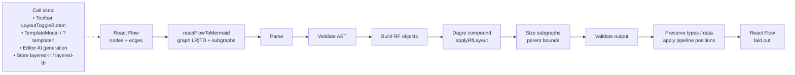

# Layout toggler pipeline

Same path as the toolbar LR/TB layout toggler (`layoutDiagramViaMermaid` / `relayoutCanvasViaMermaid`).

Hand-authored or AI positions often overlap or ignore edge flow. Round-tripping through Mermaid + compound Dagre re-ranks nodes by edges, then SizeStage wraps groups around their children.

See also: [layout-toggler-learnings.md](./layout-toggler-learnings.md).
