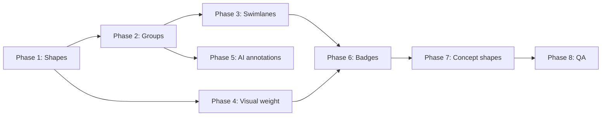

# Visual Vocabulary & Layout — Implementation Plan

Implementation plan for closing the gap between **system architecture graphs** (ArchDraw’s strength) and **richer conceptual / teaching diagrams** (roadmaps, phased pipelines, zone boundaries, role-at-a-glance shapes).

This plan consolidates findings from the LLM inference roadmap comparison and the shape/icon audit. It builds on the existing visual system (`docs/architecture-visual-system-plan.md`) and text-node work (`docs/ai-text-labels-plan.md`).

---

## Goal

Give diagrams a **richer visual language** so readers infer *role*, *zone*, *phase*, and *importance* without reading every label.

**Target outcomes:**

1. Semantic silhouettes (cloud, hexagon, shield, actor, …) render consistently in canvas + SVG export.
2. Groups read as **zones** (External, VPC, Region, tier bands) with dashed/solid border presets.
3. Optional **tier / swimlane layout** for Client → API → Compute → Data stacks.
4. Node **visual weight** (hero / normal / compact) beyond the fixed 160/200/240 grid where appropriate.
5. AI planner emits **annotations, legends, and step badges** alongside nodes and edges.
6. **Semantic micro-badges** (GPU, lock, cache, clock) complement brand logos.

**Non-goals (do not implement in this plan):**

- Hand-drawn / Excalidraw sketch theme.
- Full infographic / poster layout engine (stacked panels with diagram + bullet columns).
- Arbitrary illustration library (speedometers, custom art).
- Replacing canonical Mermaid → Dagre layout for the toolbar LR/TB toggler.
- New paid tiers or quota changes.

---

## Progress

| Phase | Step | Status | Owner area |
|-------|------|--------|------------|
| **0** | Baseline audit & shape registry | ✅ | `ShapeNode`, `nodeShapeConfig` |
| **1** | Semantic shape silhouettes (P0) | ✅ | `ShapeNode`, Mermaid, AI |
| **2** | Stronger groups & zone presets (P0) | ⬜ | `GroupNode`, store |
| **3** | Tier / swimlane layout mode (P1) | ⬜ | `relayout`, `pipeline-shared` |
| **4** | Node visual weight (P1) | ⬜ | `nodeSizing`, `stylingConstants` |
| **5** | Annotation-first AI (P1) | ⬜ | planner, concept templates |
| **6** | Semantic micro-badges (P2) | ⬜ | `ShapeNode`, icon catalog |
| **7** | Concept shapes — cube, grid (P2) | ⬜ | `ShapeNode` |
| **8** | QA, export parity, docs | ⬜ | tests, `svgExport` |



---

## Diagnosis (current state)

| Gap | Symptom | Primary files |
|-----|---------|---------------|
| **Shape debt** | `nodeShapeConfig.ts` defines CLOUD, HEXAGON, SHIELD, MONITOR_SCREEN, USER_CIRCLE, GEAR, PILL — not rendered in `ShapeNode` | `constants/nodeShapeConfig.ts`, `components/ShapeNode.tsx`, `PropertiesPanel.tsx` |
| **Flat hierarchy** | All nodes ~160–240px, similar visual weight | `lib/utils/nodeSizing.ts`, `lib/theme/stylingConstants.ts` |
| **Weak zones** | Groups are subtle tinted boxes; no dashed external boundary | `components/GroupNode.tsx` |
| **Layout** | Dagre LR/TB only; no swimlanes / tier bands | `lib/mermaid/relayout.ts`, `lib/pipeline-shared/layout/` |
| **Teaching context** | Text/annotation nodes exist but AI rarely uses step numbers, legends, callouts | `lib/ai/pipeline/mermaid-pipeline/`, `docs/ai-text-labels-plan.md` |
| **Icons** | Brand logos strong; no semantic adornments (lock, GPU, cache) | `lib/brandIcons.ts`, `lib/archIconCatalog.ts` |

**Capability snapshot (approximate):**

| Diagram type | Today | After this plan |
|--------------|-------|-----------------|
| System architecture | ~80% | ~90% |
| Tech-branded services | ~70% | ~85% |
| Teaching / concept flow | ~40% | ~65% |
| Infographic posters | ~20% | ~30% (out of scope beyond annotations) |

---

## Phase 0 — Baseline audit & shape registry (P0)

**Purpose:** Single source of truth before adding silhouettes.

### 0.1 Unify shape type unions

**Files:** `frontend/components/ShapeNode.tsx`, `frontend/lib/mermaid/types.ts`, `frontend/store/diagram/types.ts`

- Extend `ShapeType` with new values (proposed v1 set):

  ```ts
  export type ShapeType =
    | 'rectangle'
    | 'rounded-rectangle'
    | 'diamond'
    | 'cylinder'
    | 'circle'
    | 'parallelogram'
    | 'hexagon'        // LB, ingress, gateway
    | 'cloud'          // external / SaaS / third-party
    | 'shield'         // auth, WAF, secrets
    | 'actor'          // user / person (circle + stick or USER_CIRCLE silhouette)
    | 'monitor'        // web client / browser
    | 'mobile'         // mobile client
    | 'dashed-rectangle' // out-of-system, optional, future
  ```

- Add `VARIANT_TO_SHAPE` map in one module (e.g. `frontend/lib/shapeRegistry.ts`) mapping `nodeShapeConfig` variants → `ShapeType`:

  | Config variant | ShapeType |
  |----------------|-----------|
  | `ROUNDED_SQUARE` | `rounded-rectangle` |
  | `CYLINDER` | `cylinder` |
  | `DIAMOND` | `diamond` |
  | `PILL_HORIZONTAL` | `cylinder` + `cylinderAxis: 'horizontal'` |
  | `CLOUD` | `cloud` |
  | `HEXAGON` | `hexagon` |
  | `SHIELD` | `shield` |
  | `MONITOR_SCREEN` | `monitor` |
  | `MOBILE_PHONE` | `mobile` |
  | `USER_CIRCLE` | `actor` |
  | `GEAR` | `rounded-rectangle` (icon-forward; gear via `serviceType`) |

- Deprecate duplicate shape vocab in `lib/nodeShapes.ts` (`pill`, `stack`, `queue`, …) — either map to registry or mark legacy with a comment pointing to `shapeRegistry.ts`.

### 0.2 Tests

- Unit test: every `NODE_SHAPE_CONFIG` entry resolves to a supported `ShapeType`.
- Unit test: Mermaid round-trip includes new shape tokens (see Phase 1.4).

**Checklist**

- [x] `shapeRegistry.ts` created with variant → shape map
- [x] `ShapeType` extended in store + `ShapeNode`
- [x] `nodeShapes.ts` documented as legacy or aligned

---

## Phase 1 — Semantic shape silhouettes (P0)

**Purpose:** Readers recognize role from silhouette, not only label.

### 1.1 Render new silhouettes in `ShapeNode`

**File:** `frontend/components/ShapeNode.tsx`

Implement SVG/HTML renderers following existing patterns (`resolveShapeSurface`, `drop-shadow`, shared stroke tokens):

| Shape | Visual spec | Label layout |
|-------|-------------|--------------|
| `hexagon` | Flat-top hexagon, same stroke/fill as diamond family | `icon-brand` when brand detected; else centered text |
| `cloud` | Soft cloud outline (2–3 bumps), lighter fill (`external` concern default) | Label below or inside lower band |
| `shield` | Rounded shield path | `icon-brand` for auth brands (Keycloak, etc.) |
| `actor` | Circle head + shoulders **or** simple person glyph in circle | Icon-only default; short label below |
| `monitor` | Rounded rect + stand notch (minimal, not browser chrome) | `icon-brand` for web clients |
| `mobile` | Tall rounded rect (9:16-ish) | Icon-only friendly |
| `dashed-rectangle` | Rect with `stroke-dasharray`, no fill or 2% fill | Full label inside |

**Rules (align with AGENTS.md):**

- All shapes use `resolveShapeSurface()` — no transparent accent washes.
- Handle system unchanged (dynamic ±16 slots per side).
- Sizing via `calculateNodeDimensions` with per-shape min/max bands.

### 1.2 Sizing

**File:** `frontend/lib/utils/nodeSizing.ts`

| Shape | Width band | Height band | Notes |
|-------|------------|-------------|-------|
| `hexagon` | 160–200 | 88–96 | Same lane cap as diamond |
| `cloud` | 200–240 | 96–112 | Wider for external labels |
| `shield` | 160–200 | 96–112 | Taller for badge proportions |
| `actor` | 120–160 | 88–100 | Smaller entry-point nodes |
| `monitor` | 200–240 | 100–120 | |
| `mobile` | 120–160 | 100–130 | |
| `dashed-rectangle` | 160–240 | 88–112 | |

Add/update tests in `frontend/lib/utils/__tests__/nodeSizing.test.ts`.

### 1.3 Editor & factory

**Files:** `frontend/components/PropertiesPanel.tsx`, `frontend/lib/factory.ts`, `frontend/constants/nodeShapeConfig.ts`

- Add shape picker entries (grouped: **Basic** / **Semantic** / **Clients**).
- `factory.ts` / `classifyNode` in `planTranslator.ts`: map `serviceType` → shape via `shapeRegistry`.
- Revisit mappings:
  - `loadbalancer`, `ingress`, `nginx` → `hexagon` (not diamond)
  - `external`, `saas`, `thirdparty`, cloud providers → `cloud`
  - `firewall`, `waf`, `vault`, `oauth` → `shield`
  - `client`, `browser`, `webapp` → `monitor`
  - `mobile`, `ios`, `android` → `mobile`
  - `user`, `actor`, `customer` → `actor`

### 1.4 Mermaid pipeline

**Files:** `frontend/lib/mermaid/parse.ts`, `frontend/lib/mermaid/buildReactFlow.ts`, `frontend/lib/ai/pipeline/mermaid-pipeline/mermaidTranslator.ts`

- Define Mermaid node syntax for new shapes (extend parser shape regex):

  ```text
  hexagon:  id{{"label"}}
  cloud:    id([("label")])   — or custom %% archdraw-shape: hexagon on node id
  shield:   use classDef + shape override comment if Mermaid lacks native syntax
  ```

**Recommended v1 transport:** extend existing comment directive pattern (same as text nodes):

```text
%% archdraw-shape: {"id":"lb","shape":"hexagon"}
```

- `buildReactFlow.ts`: apply shape override when building RF nodes.
- `mermaidTranslator.ts`: emit overrides on round-trip.
- Update `fullCoverage.test.ts` and add `shapeRegistry.test.ts`.

### 1.5 AI planner

**Files:** `frontend/lib/ai/pipeline/mermaid-pipeline/plannerPrompts.ts`, `architecturePlanner.ts`, `conceptTemplates.ts`

- Teach planner shape semantics:

  ```text
  - Load balancers / ingress → hexagon
  - External APIs / SaaS → cloud
  - Auth / WAF / secrets → shield
  - Web clients → monitor; mobile apps → mobile; end users → actor
  - Databases → vertical cylinder; queues → horizontal cylinder
  ```

- Concept templates: update canned Mermaid to use shape directives where it improves recognition (e.g. load-balancer template → hexagon LB).

### 1.6 SVG export

**File:** `frontend/lib/svgExport.ts`

- Ensure new SVG paths/filters mirror canvas (`drop-shadow`, dashed strokes for `dashed-rectangle`).
- Add export snapshot test or visual regression note in QA checklist.

**Checklist**

- [x] All 7 new silhouettes render in `ShapeNode`
- [x] Properties panel shape picker updated
- [x] `planTranslator` / factory mappings updated
- [x] Mermaid parse + round-trip for shape directives
- [x] Planner prompt + at least 2 concept templates updated
- [x] `nodeSizing` tests green
- [x] SVG export spot-check

---

## Phase 2 — Stronger groups & zone presets (P0)

**Purpose:** Groups read as **zones** (External, VPC, Region, tier), not faint background tints.

### 2.1 Group style model

**Files:** `frontend/store/diagram/types.ts`, `frontend/components/GroupNode.tsx`

Extend group `data`:

```ts
interface GroupNodeData {
  // existing…
  groupStyle?: 'solid' | 'dashed' | 'dotted'
  groupPreset?: 'default' | 'external' | 'vpc' | 'region' | 'tier' | 'phase'
  groupSubtitle?: string   // e.g. "Public subnet"
  showZoneLabel?: boolean  // default true
}
```

**Preset defaults:**

| Preset | Border | Fill | Label position |
|--------|--------|------|----------------|
| `default` | solid 1px | 5% concern tint | top-left tag (current) |
| `external` | dashed 1.5px | 3% neutral | top-left + "External" prefix |
| `vpc` | solid 1.25px | 4% compute tint | top-left |
| `region` | solid 1px | 2% neutral | top-left |
| `tier` | solid 1px top-heavy | 6% band | left rail label (rotated optional v2) |
| `phase` | dashed 1px | 4% accent | top-left + optional step badge |

### 2.2 Properties panel

**File:** `frontend/components/PropertiesPanel.tsx`

- When a group is selected: **Zone preset** dropdown + **Border style** override.
- Color picker remains (maps to `accentColor` / `groupColor`).

### 2.3 AI & Mermaid

- Subgraph labels: `subgraph ext ["External Services"]` → `groupPreset: 'external'`.
- Optional directive: `%% archdraw-group: {"id":"ext","preset":"external","style":"dashed"}`.
- Planner guidance: wrap third-party integrations in `external` dashed groups; put multi-AZ resources in `region` groups.

### 2.4 Tests

- GroupNode renders dashed border when `groupStyle: 'dashed'`.
- Round-trip preserves preset via Mermaid directive.

**Checklist**

- [ ] `GroupNodeData` extended
- [ ] `GroupNode` renders solid/dashed/dotted
- [ ] Properties panel zone controls
- [ ] Mermaid directive parse + emit
- [ ] Planner teaches external/region grouping

---

## Phase 3 — Tier / swimlane layout mode (P1)

**Purpose:** Client → API → Compute → Data reads top-to-bottom or left-to-right **in lanes**, not only as a force-directed graph.

### 3.1 Layout strategy

**Do not replace** canonical `layoutDiagramViaMermaid` for the toolbar toggler.

Add an **optional** layout pass:

**Files:** `frontend/lib/pipeline-shared/layout/TierLayout.ts` (new), `frontend/lib/mermaid/pipeline-stages/`, `frontend/store/diagramStore.ts`

**Approach A (recommended v1):** Post-Dagre **lane assignment**

1. Run existing Dagre layout inside each subgraph.
2. Assign each top-level node/subgraph to a tier via `data.tier` or `classifyNode` concern:
   - `client` → lane 0
   - `compute` (gateways) → lane 1
   - `compute` (services) → lane 2
   - `data` → lane 3
   - `async` → lane 2.5 (offset row) or side band
   - `external` → bottom or right strip
3. Translate node `y` (TB) or `x` (LR) into fixed lane coordinates.

**Approach B (v2):** Background tier band groups auto-created as non-interactive `groupPreset: 'tier'` rectangles behind lanes.

### 3.2 User control

- Toolbar or layout menu: **Layout mode** → `Auto` | `Tier swimlanes` (persist per canvas in store).
- Only applies on explicit user action or AI `layoutMode: 'tier'` flag — not default generation.

### 3.3 AI

- Planner optional field: `"layoutMode": "tier"` for prompts like "layered architecture" or "show tiers".
- Document in `plannerPrompts.ts`; default remains `auto`.

### 3.4 Tests

- `TierLayout.test.ts`: 4-tier sample graph gets non-overlapping lane Y positions.
- Relayout preserves `parentNode` relationships.

**Checklist**

- [ ] `TierLayout.ts` with lane assignment
- [ ] Store action `applyTierLayout()` wired to toolbar
- [ ] Does not break existing `toggleLayoutDirection`
- [ ] Unit tests for lane ordering

---

## Phase 4 — Node visual weight (P1)

**Purpose:** Hero nodes (API Gateway, main LLM) vs compact supporting nodes (metrics, cache sidecar).

### 4.1 Data model

**Files:** `frontend/store/diagram/types.ts`, `frontend/components/ShapeNode.tsx`

```ts
type VisualWeight = 'compact' | 'normal' | 'hero'

interface ShapeNodeData {
  visualWeight?: VisualWeight  // default 'normal'
}
```

**Rendering:**

| Weight | Grid | Stroke | Label | Icon slot |
|--------|------|--------|-------|-----------|
| `compact` | 120–160 (below grid or S only) | 1px | single line, smaller | 32px |
| `normal` | 160/200/240 | 1.25px | current | 48px prominent |
| `hero` | up to 280 wide (soft cap) | 1.5px emphasis | title + subtitle | 56px |

Add `SIZE_HERO = 280` to `stylingConstants.ts` as optional max for hero only (do not pollute default grid).

### 4.2 AI rules

- Entry gateway, primary database, core LLM service → `hero`.
- Observability, side caches, config → `compact`.
- Enforce in `scoreDiagram.ts` heuristics (optional bonus for appropriate weight).

### 4.3 Properties panel

- **Size emphasis** dropdown: Compact / Normal / Hero.

**Checklist**

- [ ] `visualWeight` on node data
- [ ] `nodeSizing` respects weight
- [ ] Properties panel control
- [ ] Planner + scoring hints
- [ ] Tests for hero/compact dimensions

---

## Phase 5 — Annotation-first AI (P1)

**Purpose:** Teaching diagrams get titles, step numbers, legends, and side notes — not only boxes and arrows.

**Prerequisite:** `docs/ai-text-labels-plan.md` (text + annotation Mermaid directives).

### 5.1 New directive types

**Files:** `frontend/lib/mermaid/parse.ts`, `frontend/lib/mermaid/textPlacement.ts`

```text
%% archdraw-step: {"id":"s1","number":1,"anchor":"subgraph:foundations"}
%% archdraw-legend: {"id":"leg1","items":[{"label":"Sync","style":"solid"},{"label":"Async","style":"dashed"}],"anchor":"top"}
%% archdraw-callout: {"id":"c1","text":"KV cache reused across decode steps","anchor":"node:kv_cache","side":"right"}
```

### 5.2 Renderers

| Directive | Canvas implementation |
|-----------|----------------------|
| `archdraw-step` | Small circle badge node (new `stepBadgeNode` **or** `textLabelNode` with `variant: 'step'`) positioned at subgraph top-left |
| `archdraw-legend` | `annotationNode` with structured `body` markdown list **or** dedicated `LegendNode` (v2) |
| `archdraw-callout` | `annotationNode` + optional dashed connector edge (`edgeVariant: 'dotted'`, `importance: 'supporting'`) to anchor node |

**v1 recommendation:** Reuse `textLabelNode` + `annotationNode`; defer `LegendNode` component unless needed.

### 5.3 Placement

**File:** `frontend/lib/mermaid/pipeline-stages/TextPlacementStage.ts`

- After Dagre: place step badges at subgraph origin; legends at `anchor: top` right; callouts beside target node with collision nudge.

### 5.4 Planner prompts

**Files:** `plannerPrompts.ts`, `architecturePlanner.ts`

Teach when to emit:

- Diagram title (`archdraw-text`, `anchor: top`, `size: heading`).
- Section notes for each subgraph (`archdraw-note`, `anchor: subgraph:<id>`).
- Step numbers for phased pipelines (`archdraw-step`).
- Legend when graph has 2+ edge semantics.

**Example planner snippet:**

```json
{
  "mermaid": "graph TD\n  subgraph s1 [\"1. Foundations\"]\n    ...\n  end\n  %% archdraw-step: {\"number\":1,\"anchor\":\"subgraph:s1\"}\n  %% archdraw-text: {\"text\":\"LLM Inference Roadmap\",\"size\":\"heading\",\"anchor\":\"top\"}"
}
```

### 5.5 Concept templates

- Add titled header + one annotation to 2–3 high-traffic templates (load balancer, RAG, kafka) as reference quality.

**Checklist**

- [ ] Parse + emit `archdraw-step`, `archdraw-legend`, `archdraw-callout`
- [ ] TextPlacementStage handles new anchors
- [ ] Planner prompt examples updated
- [ ] At least 2 concept templates demonstrate annotations
- [ ] E2E: generate → relayout → Mermaid panel round-trip

---

## Phase 6 — Semantic micro-badges (P2)

**Purpose:** Small role icons (GPU, lock, cache, clock) on nodes — independent of brand logos.

### 6.1 Data model

```ts
interface ShapeNodeData {
  badge?: 'gpu' | 'lock' | 'cache' | 'clock' | 'batch' | 'stream' | 'replica' | null
}
```

### 6.2 Rendering

**File:** `frontend/components/ShapeNode.tsx`

- 16–20px badge chip at top-right corner (inside shape bounds).
- Icons from `archIconCatalog` or Lucide subset.
- AI infers badge from keywords: `gpu|cuda` → `gpu`, `auth|tls` → `lock`, `cache|memo` → `cache`.

### 6.3 Properties panel

- Optional **Badge** dropdown on shape nodes.

**Checklist**

- [ ] Badge chip renders on all shape types (including diamond/hexagon clip)
- [ ] `nodeIconResolver` or small `inferNodeBadge(label, serviceType)` helper
- [ ] Planner optional badge field
- [ ] SVG export includes badge

---

## Phase 7 — Concept shapes — cube & grid (P2)

**Purpose:** Hardware / ML teaching diagrams (memory hierarchy, token grids). Lower priority than Phases 1–5.

### 7.1 `cube` shape

- Isometric box (3 visible faces); back edges dashed (same technique as cylinder back arc).
- Use for: SRAM, HBM, memory tiers, GPU SM.
- Default concern: `compute`.

### 7.2 `grid` shape

- Node containing a small N×M cell grid (e.g. 3×3 for tokens).
- `data.gridCols`, `data.gridRows`, optional `data.gridLabels`.
- Fixed size; label below grid.

### 7.3 Scope control

- Not required for Mermaid v1 — use `%% archdraw-shape: {"shape":"cube"}` only.
- AI uses sparingly; validator warns if >2 grid/cube nodes unless prompt mentions "memory" or "token".

**Checklist**

- [ ] `cube` silhouette in ShapeNode
- [ ] `grid` silhouette in ShapeNode
- [ ] Sizing tests
- [ ] Parser directive support

---

## Phase 8 — QA, export parity, documentation (P0 ongoing)

### 8.1 Test matrix

| Area | Test file |
|------|-----------|
| Shape registry | `lib/__tests__/shapeRegistry.test.ts` |
| Node sizing | `lib/utils/__tests__/nodeSizing.test.ts` |
| Mermaid shapes | `lib/mermaid/parse.test.ts`, `fullCoverage.test.ts` |
| Group presets | `components/__tests__/GroupNode.test.tsx` (add) |
| Tier layout | `lib/pipeline-shared/layout/__tests__/TierLayout.test.ts` |
| Text placement | `lib/mermaid/__tests__/textPlacement.test.ts` |
| AI planner | `lib/ai/pipeline/mermaid-pipeline/__tests__/plannerPrompts.test.ts` |

### 8.2 Manual visual checklist

- [ ] LR and TB layout with new shapes
- [ ] Group dashed external zone readable in dark + light canvas
- [ ] Tier layout 30+ node diagram
- [ ] PNG + SVG export match canvas
- [ ] Relayout preserves shape overrides and group presets
- [ ] Edit mode: add hexagon LB, cloud Stripe, shield WAF manually

### 8.3 Docs & AGENTS.md updates

- Add shape semantics table to `AGENTS.md` §6.
- Note `layoutMode: tier` in layout section.
- Bump `PIPELINE_VERSION` when AI shape/annotation semantics change (cache bust).

---

## Implementation order (recommended sprints)

### Sprint 1 — Shape debt (highest ROI)

1. Phase 0 — registry
2. Phase 1.1–1.3 — render + editor + factory
3. Phase 1.4 — Mermaid directives
4. Phase 8 tests for shapes

**Exit criteria:** LB renders as hexagon; Stripe/SaaS as cloud; WAF as shield in AI + manual.

### Sprint 2 — Zones & weight

1. Phase 2 — group presets
2. Phase 4 — visual weight
3. Phase 1.5 — planner shape rules

**Exit criteria:** External services in dashed group; hero API Gateway on sample template.

### Sprint 3 — Teaching & layout

1. Phase 5 — step/legend/callout directives + planner
2. Phase 3 — tier layout mode (v1 post-Dagre lanes)

**Exit criteria:** "LLM inference pipeline" prompt produces titled diagram with phased subgraphs + notes.

### Sprint 4 — Polish

1. Phase 6 — badges
2. Phase 7 — cube/grid (if needed)
3. Phase 8 — export + AGENTS.md

---

## Risk & mitigation

| Risk | Mitigation |
|------|------------|
| Mermaid lacks native syntax for some shapes | Use `%% archdraw-shape` directives (proven pattern from text nodes) |
| Layout breaks with many shape sizes | Keep compact/hero as opt-in; default stays on grid |
| SVG export drift | Extend `prepareReactFlowForImageExport` for dashed group borders + new SVG paths |
| AI overuses annotations | Cap: max 1 title, 1 legend, 1 note per subgraph, 5 steps total; scoreDiagram penalty |
| Shape proliferation | v1 cap: 13 shape types; cube/grid stay P2 |

---

## File index (quick reference)

| Concern | Files |
|---------|-------|
| Shape rendering | `components/ShapeNode.tsx`, `lib/theme/stylingConstants.ts` |
| Shape config | `constants/nodeShapeConfig.ts`, `lib/shapeRegistry.ts` (new) |
| Sizing | `lib/utils/nodeSizing.ts` |
| Groups | `components/GroupNode.tsx`, `components/PropertiesPanel.tsx` |
| Mermaid | `lib/mermaid/parse.ts`, `buildReactFlow.ts`, `textPlacement.ts`, `relayout.ts` |
| AI | `lib/ai/pipeline/mermaid-pipeline/plannerPrompts.ts`, `architecturePlanner.ts`, `conceptTemplates.ts` |
| Layout | `lib/pipeline-shared/layout/TierLayout.ts` (new), `IntegratedLayout.ts` |
| Export | `lib/svgExport.ts`, `lib/utils/prepareReactFlowForImageExport.ts` |
| Store | `store/diagram/types.ts`, `store/diagram/slices/graphSlice.ts` |

---

## Success metrics

- **Recognition:** In user testing, ≥80% correctly identify LB / external / auth nodes without reading labels (hexagon / cloud / shield).
- **Teaching:** "LLM inference" prompt yields diagram with ≥3 subgraphs, title, and ≥2 annotations.
- **Regression:** `npm test` + `tsc --noEmit` green; no layout toggler regressions.
- **Export:** PNG/SVG visually match canvas for all new shapes and dashed groups.

---

## Related documents

- [architecture-visual-system-plan.md](./architecture-visual-system-plan.md) — tokens, concerns, size grid
- [ai-text-labels-plan.md](./ai-text-labels-plan.md) — text + annotation directives (prerequisite for Phase 5)
- [layout-toggler.md](./layout-toggler.md) — canonical Mermaid → Dagre path (do not break)
- [AGENTS.md](../AGENTS.md) — agent rules; update after Phase 1 + 3 ship
